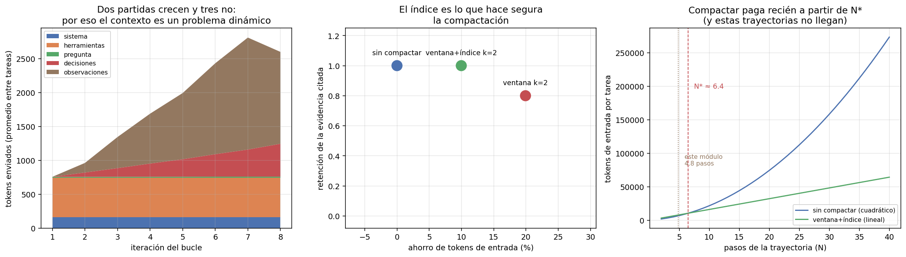

# 02 — Context engineering: el contexto como problema de asignación

## La ventana no es memoria, es un presupuesto

La metáfora dominante —"la ventana de contexto es la memoria del modelo"— sugiere
que el problema es de **almacenamiento**: si entra, está bien; si no entra, hay que
achicar. Esa metáfora hace tomar decisiones malas, porque el problema real es de
**asignación**: cada token que se gasta en una cosa desplaza a otra, y en un bucle
agéntico el mismo token se paga muchas veces.

§1 dejó el planteo hecho: acotar la observación a 1.200 caracteres no perdía
información, la cobraba en tokens, porque el agente necesitaba una iteración más y
cada iteración reenvía la conversación entera. Esta sección mide eso sobre las
mismas trayectorias y saca la regla de decisión.

Todo lo que sigue usa el tokenizador real del modelo (`tiktoken`, `o200k_base`), no
la regla de cuatro caracteres por token.

## Las cinco partidas

El contexto de una iteración se reparte en cinco partidas, y lo que las distingue
no es su tamaño sino **cuáles crecen**:

```
partida            iteración 1    última iteración     crece
------------------------------------------------------------
sistema                    162                 162        no
herramientas               580                 580        no
pregunta                    14                  14        no
decisiones                   0                 250        sí
observaciones                0                 944        sí
TOTAL                      756                1950      ×2.6
```

Tres observaciones que cambian decisiones de diseño:

**Los esquemas de herramientas son la partida más grande del arranque.** 580 tokens
contra 162 del prompt de sistema: las cuatro definiciones de herramientas pesan
tres veces y media más que todas las instrucciones. Es la partida que
sistemáticamente se olvida —no se escribe en ningún prompt, la serializa el
proveedor— y se paga en **todas** las iteraciones. Agregar una quinta herramienta
"por si acaso" no cuesta un poco: cuesta su esquema multiplicado por el largo de
todas las trayectorias futuras.

**Las observaciones son el 79% de lo que crece.** 944 de los 1.194 tokens que se
suman entre la primera y la última iteración. Es coherente con §1: el texto que las
herramientas devuelven es la palanca grande, y por eso `max_chars_observacion` fue
uno de los dos factores del factorial.

**El contexto final es una fracción de lo que se pagó.** 1.950 tokens al terminar,
pero la suma de todos los contextos enviados es mucho mayor. Eso es lo siguiente.



## El multiplicador de reenvío

Cada iteración del bucle manda de nuevo todo el historial. El costo de entrada de
una tarea no es el tamaño de su contexto final: es **la suma de todos los contextos
intermedios**.

```
tarea     pasos  contexto final   enviado total  multiplicador
--------------------------------------------------------------
t-01          2           1,028           1,783           1.73
t-04          7           3,655          14,626           4.00
t-08          8           1,799          10,657           5.92
t-10          8           3,398          15,973           4.70
--------------------------------------------------------------
media                                                     3.32
```

En promedio se paga **3,32 veces** el contexto final; en la trayectoria más larga,
5,92. Y el número que ordena todo lo demás:

> Del total enviado (85.654 tokens), el prefijo fijo —sistema + esquemas de
> herramientas + pregunta— se reenvió por **43.896 tokens: el 51,2% de todo el
> gasto de entrada del módulo**.

La mitad del gasto de entrada de un agente es **texto idéntico, reenviado**. Eso
tiene dos consecuencias que apuntan en direcciones opuestas y conviene no
confundir:

1. Es la razón por la que el caching de prefijo es la optimización de costo más
   rentable de un bucle agéntico, y no una micro-optimización. §8 la cuantifica.
2. Es la razón por la que **compactar la historia rinde menos de lo que parece**:
   la compactación ataca la mitad del gasto que no es prefijo, y el prefijo no se
   toca.

## Tres políticas de gasto

Con el problema planteado como asignación, las estrategias de compactación son
políticas de gasto comparables:

| Política | Qué hace | Riesgo |
|---|---|---|
| `SinCompactar` | Todo lo que pasó sigue en contexto | Costo cuadrático en el número de pasos |
| `VentanaDeslizante(k)` | Conserva los últimos *k* pares y descarta el resto | Lo descartado no deja rastro: el agente repite trabajo sin enterarse |
| `VentanaConIndice(k)` | Conserva los últimos *k* y reemplaza el resto por **una línea de índice**, archivando el contenido en memoria externa | El agente tiene que acordarse de ir a buscarlo |

La tercera es la interesante porque convierte el problema de contexto en un
problema de retrieval —que es de lo que trata `02` entero—: en vez de tirar la
observación o arrastrarla, se guarda fuera y se deja en contexto lo justo para
saber que existe y cómo pedirla. El índice es literalmente esto, tomado de la
tarea `t-04` en su última iteración:

```
[contexto compactado] Los pasos anteriores se archivaron en memoria externa. Índice:
- p0: buscar_corpus → 612 caracteres, menciona circular-01-sii-iva-digital.txt,
      ley-02-ley-21210-modernizacion.txt, circular-05-sii-factura-electronica.txt
- p1: leer_norma → 2050 caracteres, menciona circular-01-sii-iva-digital.txt
- p2: leer_norma → 2053 caracteres, menciona ley-02-ley-21210-modernizacion.txt
- p3: buscar_corpus → 566 caracteres, menciona decreto-04-modificacion-presupuestaria.txt,
      glosa-01-presupuesto-salud.txt
Si necesitás alguno completo, llamá a 'recuperar_memoria' con su clave.
```

Cinco líneas en lugar de 5.281 caracteres de observaciones, con los
identificadores canónicos intactos.

### Lo que dice la contabilidad

Recompactando el historial que el agente efectivamente produjo:

```
política                 tokens de entrada    ahorro   retención evidencia
--------------------------------------------------------------------------
sin compactar                       85,654     0.0%                 1.000
ventana k=2                         68,583    19.9%                 0.800
ventana+índice k=2                  77,112    10.0%                 1.000
```

*Retención* es la fracción de los documentos que el agente terminó citando que
seguía visible en el contexto de la última iteración. La ventana pelada ahorra el
doble y **pierde un 20% de la evidencia**: llega al final citando documentos que ya
no puede ver. El índice cuesta la mitad del ahorro y recupera la retención completa.

> La lección de diseño no es "compactá" sino **"lo que se compacta tiene que dejar
> una dirección"**. Una línea por paso archivado, con los identificadores que
> menciona, es lo que separa una compactación segura de una que produce citas que
> el agente ya no puede sostener.

## Pero la contabilidad no es el comportamiento

Acá es donde esta sección se salva de ser un ejercicio de aritmética. Todo lo
anterior es un contrafáctico sobre trayectorias fijas: dice cuántos tokens se
habrían enviado, no qué habría hecho el modelo. Con menos contexto, el agente
decide distinto.

La corrida real, con la política de ventana+índice y la herramienta
`recuperar_memoria` disponible:

```
métrica                      sin compactar    ventana+índice         delta
--------------------------------------------------------------------------
acierto exacto                       0.500             0.417        -0.083
F1 de docs citados                   0.556             0.472        -0.083
pasos promedio                        4.83              5.83         +1.00
tokens de entrada                   69,896            78,325        +8,429
tareas sin respuesta                     2                 6            +4

llamadas a 'recuperar_memoria': 1
```

**La contabilidad prometía un 10% de ahorro y la corrida real costó un 12% más.**
Y además bajó el acierto. Los tres mecanismos, en orden de tamaño:

1. **Compactar agregó un paso por tarea** (4,83 → 5,83). Con menos historia
   visible, el agente vuelve a buscar lo que ya había buscado. Y un paso más no
   cuesta lo que se ahorró compactando: cuesta **el prefijo completo otra vez**,
   757 tokens, más de lo que la compactación ahorró en esa iteración.
2. **La herramienta de memoria engorda el prefijo.** Su esquema son 92 tokens que
   viajan en cada iteración de cada tarea, se use o no.
3. **El agente casi no usó la memoria: una sola llamada en doce tareas.** Tenía el
   puntero en contexto y no lo siguió. Darle una salida de emergencia no alcanza
   para que la tome; eso es diseño de incentivos, no de capacidad, y es el mismo
   tipo de problema que §3 trata con los mensajes de error.

## La regla de decisión: cuándo compactar sí paga

El resultado anterior no dice que compactar esté mal. Dice que **se aplicó por
debajo del punto de equilibrio**, y ese punto se puede calcular con las constantes
que ya se midieron.

Sin compactar, el contexto de la iteración *i* es `P + i·h` —prefijo fijo más
historia acumulada— así que el total de una trayectoria de *N* pasos es

```
sin compactar:  N·P + h·N(N-1)/2      (cuadrático en N)
con ventana k:  N·(P + s + k·h)       (lineal en N)
```

donde `s` es el sobrecosto de compactar. Los tres parámetros están medidos, no
supuestos:

```
prefijo fijo por iteración (P) : 757 tokens
historia agregada por paso (h) : 311 tokens
sobrecosto de compactar (s)    : 225 tokens/iteración (92 de esquema + 133 de índice)
```

Una cuadrática cruza a una lineal en algún punto, y acá es

```
N* = 1 + 2(s + k·h)/h ≈ 6.4 pasos

  N pasos   sin compactar   ventana+índice    ahorro
----------------------------------------------------
        4           4,896            6,419   -31.1%
        6           9,212            9,628    -4.5%
        8          14,774           12,838    13.1%
       16          49,479           25,675    48.1%
       32         178,679           51,350    71.3%
       48         387,602           77,025    80.1%
```

Las trayectorias de este módulo promedian **4,8 pasos**. Están por debajo de N*, y
por eso compactar costó plata en vez de ahorrarla — exactamente lo que midió la
corrida real. A 32 pasos, la misma política ahorra 71%.

> **Regla:** compactar es una inversión con costo fijo por iteración y ahorro
> creciente con el largo de la trayectoria. Con `N ≈ 5` no se recupera; con
> `N ≈ 30` es la diferencia entre un producto viable y uno que no. Antes de
> aplicarla, medí `P`, `h` y el largo típico de tus trayectorias: son tres números
> y salen de las mismas trazas que ya tenés.

Y el corolario incómodo para la práctica habitual: la compactación es una función
que casi todos los frameworks de agentes traen activada por defecto, con un umbral
fijo, sin conocer ni `P` ni `h` ni la distribución de largos del caso de uso.

## Memoria externa es retrieval, y ya sabemos hacer retrieval

La conexión con `02` no es una analogía: es la misma operación. Una observación
archivada con una línea de índice es un documento con su metadata; recuperarla por
clave es un `filtro de metadatos` (`02 §7`); recuperarla por contenido sería
búsqueda. Todo lo que `02` estableció aplica — incluido su resultado más útil, que
la mayoría de las consultas se resuelven con un filtro estructurado y no hace falta
nada más caro.

Lo que este módulo agrega es la parte que `02` no tenía que resolver: **quién
decide cuándo recuperar**. En un pipeline RAG lo decide el programador, siempre, en
el mismo lugar. En un bucle agéntico lo decide el modelo, y la única llamada a
`recuperar_memoria` en doce tareas dice que esa decisión no se toma sola.

## Estado del arte (2026)

| Aspecto | Estado | Detalle |
|---|---|---|
| Contexto como recurso a administrar | ✅ Consenso | "Context engineering" desplazó a "prompt engineering" como marco dominante |
| Compaction automática en frameworks | 🟢 Estándar | Presente por defecto; los umbrales rara vez se calibran contra el caso de uso |
| Caching de prefijo del proveedor | 🟢 Maduro | Ataca el 51% del gasto que este módulo midió; ver §8 |
| Memoria externa direccionable | 🟡 En adopción | Fácil de exponer, difícil de lograr que el agente la use |
| Degradación con contexto largo | 🟡 Documentada, mal medida | Se reporta pérdida de atención en contextos largos; la magnitud depende mucho del modelo y la tarea |
| Punto de equilibrio de compactar, publicado | 🔴 Raro | Se recomienda compactar sin decir a partir de qué largo conviene |

## Límites de esta medición

- **12 tareas, un modelo, una réplica.** Los deltas de acierto (±0,083) son una
  tarea que cambia de signo. Lo robusto acá es la aritmética del presupuesto —el
  51,2% de prefijo reenviado, el multiplicador 3,32, el N* ≈ 6,4—, que no depende
  del modelo sino de la estructura del bucle.
- **`P`, `h` y `s` son de este harness.** Con más herramientas, `P` sube y N* baja;
  con observaciones más largas, `h` sube y N* baja también. La fórmula se traslada,
  los números no.
- **La parte de contabilidad es un contrafáctico**, y su discrepancia con la
  corrida real (−10% previsto contra +12% observado) es justamente el resultado que
  vale la pena leer: la retroalimentación del comportamiento domina al ahorro
  contable.
- **`k=2` no está optimizado.** No se barrió el parámetro; se eligió el valor más
  agresivo razonable para que el efecto fuera visible.

## Lo que viene en la próxima sección

Dos cabos sueltos apuntan al mismo lugar. Los esquemas de herramientas resultaron
la partida fija más cara (580 de 756 tokens), y `t-08` de §1 sigue fallando porque
`vecinos_grafo` devuelve un salto de un tipo de relación por llamada. Las dos son
la misma pregunta: **cuál es la unidad correcta de delegación**. §3 trata la
herramienta como un contrato y mide qué pasa cuando la granularidad está mal
elegida.

## Conexiones

- **`04 §1` (prefill/decode)**: el prefijo reenviado es exactamente la fase de
  prefill, la barata por token — y aun así es el 51,2% del gasto de entrada. Que
  sea prefill es también lo que lo hace cacheable (§8).
- **`03 §4` (caching multinivel)**: aquel capítulo cachea respuestas; el bucle
  agéntico necesita cachear *prefijos*, que es otra capa y ataca otra cosa.
- **`02 §7` (metadata estructurado)**: recuperar una observación archivada por
  clave es el mismo filtro barato que ahí se defendió frente a alternativas caras.
- **`02` completo**: memoria externa es retrieval. Lo nuevo es que el que decide
  recuperar es el modelo, no el programador.
- **§1**: las trayectorias que se miden acá son las que produjo el factorial de esa
  sección; el "cuesta más iteraciones" que allá quedó como observación, acá tiene
  una fórmula y un punto de corte.
- **§8**: el 51,2% de prefijo reenviado es el insumo del cálculo de caching de
  prefijo, y el largo de trayectoria es la variable que gobierna la varianza del
  costo por tarea.
