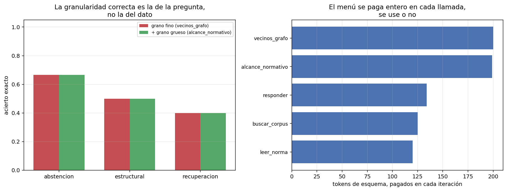

# 03 — Diseño de herramientas: la tool como contrato

## La herramienta es la unidad de delegación

Un agente no puede hacer nada que sus herramientas no expongan. Eso convierte al
diseño del juego de herramientas en la decisión de arquitectura más consecuente del
harness, y la trata casi siempre como un detalle de implementación: se envuelve la
función que ya existía, se le pone un docstring y se sigue.

El marco correcto es el de un **contrato incompleto**. La herramienta especifica
formalmente lo que puede —el JSON Schema de sus argumentos— y deja el resto a la
prosa de la descripción y a lo que el modelo infiera. Tres preguntas de diseño
salen de ahí, y esta sección mide las tres:

1. **Granularidad**: ¿en qué unidades se delega? Una llamada por dato o una por
   pregunta.
2. **Precio de estar en el menú**: el esquema se paga en cada iteración de cada
   tarea, se use o no.
3. **Qué devuelve cuando falla**: el error como canal de enseñanza, y como único
   canal de enseñanza.

## Granularidad: la herramienta tiene que tener la forma de la pregunta

§1 dejó un fallo diagnosticado y sin tratar. La tarea `t-08` —*"¿Qué documentos
dependen en hasta dos saltos del DS 250?"*— es irresoluble con `vecinos_grafo`,
que devuelve **un salto, de un tipo de relación, en una dirección, por llamada**.
Cubrir dos saltos sobre seis tipos de relación y dos direcciones necesita más
llamadas de las que caben en el presupuesto de pasos. El agente no falla por falta
de capacidad ni de información: falla porque la unidad de delegación está mal
elegida.

El tratamiento es una herramienta de grano grueso sobre **exactamente el mismo
grafo**:

```python
alcance_normativo(doc_id, max_saltos=2, direccion="in")
# → los documentos conectados en hasta N saltos, por cualquier tipo de relación
```

No agrega información: agrega **una unidad de delegación que coincide con la forma
de la pregunta**. Que la semántica sea la correcta no es una opinión — `alcance_acotado`
reproduce exactamente los siete goldens multi-hop congelados de `05`, y eso lo
verifica un test.

```
métrica                       grano fino    + grano grueso         delta
------------------------------------------------------------------------
acierto exacto                     0.500             0.500         0.000
F1 de docs citados                 0.556             0.500        -0.056
pasos promedio                      4.83              4.00         -0.83
tokens de entrada                 69,896            52,416       -17,480
costo USD                         0.0120            0.0090       -0.0030
tareas sin respuesta                   2                 2             0
```

**El acierto no se movió. El costo bajó un 25% y los pasos un 17%.**



## Por qué el acierto no se movió, aunque la herramienta funcionó

Acá está lo que hace útil a esta sección, y es un resultado que había que mirar
antes de festejar el −25%. La herramienta nueva hizo exactamente lo que tenía que
hacer, y `t-08` **sigue fallando**:

```
0 alcance_normativo(doc_id="ds-250", max_saltos=2)                    -> error_ejecucion
1 buscar_corpus(consulta="DS 250")                                    -> ok
2 alcance_normativo(doc_id="decreto-03-reglamento-compras-publicas.txt",
                    max_saltos=2)                                     -> ok   ← la respuesta completa
3 alcance_normativo(doc_id="resolucion-01-chilecompra-compra-agil.txt", ...) -> ok
4 alcance_normativo(doc_id="oficio-02-contraloria-trato-directo.txt", ...)   -> ok
5 alcance_normativo(doc_id="do-02-extracto-licitacion-publica.txt", ...)     -> ok
6 alcance_normativo(doc_id="glosa-05-presupuesto-interior.txt", ...)         -> ok
7 alcance_normativo(doc_id="do-02-extracto-licitacion-publica.txt", ...)     -> ok
                                                              → se acabaron los pasos
```

En el **paso 2** la observación contiene los cuatro documentos que el golden
espera, exactos. El agente tenía la respuesta completa, y siguió cinco pasos más
expandiendo cada resultado hasta quedarse sin presupuesto y no responder nunca.

Comparado con la trayectoria de §1 —ocho errores idénticos por un `doc_id`
inventado— este es un fallo de otra especie: ya no es que la herramienta no pueda
responder, es que **el agente no reconoce que ya respondió**. Arreglar la
granularidad era necesario y no era suficiente.

> Cada arreglo del harness descubre el siguiente cuello de botella. El de §1 era el
> canal de error; el de §3 es la granularidad; el que queda a la vista ahora es el
> criterio de parada — cuándo el agente debe concluir que terminó. Eso es §8.

Y explica el `−0,056` de F1: sin cambio en aciertos exactos, con una tarea que
antes citaba algo parcialmente correcto y ahora no cita nada porque no llegó a
responder.

## El precio de estar en el menú

Los esquemas de herramientas fueron en §2 la partida fija más cara del contexto:
580 de los 757 tokens de prefijo. Desagregado:

```
herramienta              tokens de esquema
------------------------------------------
vecinos_grafo                          200
alcance_normativo                      199
responder                              134
buscar_corpus                          125
leer_norma                             120
TOTAL (5 tools)                        778
```

Cada uno de esos números se paga **en cada iteración de cada tarea, se use la
herramienta o no**. Para `alcance_normativo`:

```
199 tokens × 48 iteraciones del brazo = 9.552 tokens de peaje
    (pagados también en las tareas de recuperación y abstención que nunca la llaman)
usos efectivos                          = 7
ahorro neto de tokens de entrada        = 17.480  → el peaje se recupera 1,8 veces
```

Se pagó sola, pero el margen no es enorme, y el cálculo tiene la forma de cualquier
decisión de costo fijo:

> Una herramienta se paga sola si los pasos que ahorra valen más que su esquema
> multiplicado por **todas** las iteraciones de **todas** las tareas, incluidas
> aquellas donde no se usa. Con trayectorias de cinco pasos y una docena de tareas,
> una herramienta de 200 tokens necesita ahorrar del orden de dos pasos completos
> para empatar.

De ahí sale la regla práctica sobre los servidores MCP con cuarenta herramientas
—el tema de §4—: no es que "confundan al modelo", es que **cobran peaje en cada
iteración**, y el peaje de treinta herramientas que nunca se usan es un impuesto
fijo sobre todo lo que el agente haga.

Dos notas de diseño que salen de la misma tabla:

- `vecinos_grafo` y `alcance_normativo` cuestan casi lo mismo (200 y 199) y no
  hacen lo mismo. El costo del esquema depende del número de parámetros y del largo
  de la descripción, no de la potencia de la herramienta. Herramientas más útiles
  no cuestan más.
- La descripción en prosa **es parte del prompt** aunque no se escriba en el
  prompt. La de `alcance_normativo` incluye "usalo para preguntas de dependencia
  transitiva en vez de encadenar llamadas a `vecinos_grafo`": eso es instrucción de
  ruteo, viaja en la partida de herramientas y se paga como tal.

## El error como canal de enseñanza

§1 midió el efecto agregado: recuperación tras error de 0,222 a 1,000 con el
contrato explícito. Desagregado por tipo de fallo sobre las mismas trayectorias:

```
opaco+completa       errores= 10  recuperación=0.222 (n=9)  {"error_ejecucion": 10}
contrato+completa    errores=  3  recuperación=1.000 (n=3)  {"error_ejecucion": 3}
```

Los diez errores son del mismo tipo —`error_ejecucion`— y eso es en sí un dato: el
modelo no inventó nombres de herramienta ni mandó argumentos que violaran el
esquema. **El JSON Schema hizo su trabajo.** Lo que el esquema no puede expresar es
que `"ds-250"` no es un `doc_id` válido: sintácticamente es un string, como
corresponde. Toda la validación semántica cae del lado de la ejecución, y ahí el
único canal disponible es el mensaje de error.

De ahí que los tres tipos de fallo no sean intercambiables y necesiten contratos
distintos:

| Tipo | Qué lo corrige | Quién debería haberlo evitado |
|---|---|---|
| `herramienta_desconocida` | La lista de nombres disponibles | El esquema ya la trae; es un fallo raro |
| `argumentos_invalidos` | El campo que falló y los obligatorios | El JSON Schema, casi siempre |
| `error_ejecucion` | **Qué valor era válido**, con candidatos concretos | Nadie: es irreductiblemente semántico |

El mensaje que da vuelta `t-08` en §1 no dice "doc_id inválido". Dice:

```
ERROR en 'vecinos_grafo'. Esperado: un doc_id presente en el grafo normativo.
Recibido: ds-250. Siguiente paso: usá 'buscar_corpus' para ubicar el documento primero.
```

Las tres partes hacen trabajo distinto: **esperado** nombra la dimensión que falló
(no fue el tipo de relación), **recibido** confirma qué se interpretó, y **siguiente
paso** convierte el fallo en una acción disponible. Cuando hay candidatos cercanos,
el error los lista —`get_close_matches` sobre los identificadores reales del
corpus—, que es entity resolution barata puesta al servicio del bucle.

## Paginación y el contrato de salida

La cuarta regla de diseño no se puede demostrar con este corpus, y conviene decirlo
antes que exagerar el caso:

```
documentos del corpus            : 40
tokens totales                   : 24,918
documento más largo              : ley-03-ley-19886-compras-publicas.txt (4,304 caracteres)
tamaño de página de 'leer_norma' : 2,000 caracteres  →  el más largo son 2.2 páginas
```

En un corpus donde el documento más largo son 2,2 páginas, la paginación casi no
muerde. La regla se sostiene igual, y el argumento no es de tamaño sino de contrato:

> Una herramienta cuyo tamaño de salida depende del dato de entrada **no tiene
> contrato de salida**. El agente no puede planificar contra ella y el presupuesto
> de contexto de §2 deja de ser calculable.

El contrafáctico da la escala: una herramienta `volcar_corpus` sin paginar metería
**24.918 tokens en una sola observación —33 veces el prefijo fijo de §2—** y, por
el multiplicador de reenvío, los volvería a mandar en cada iteración posterior. Con
el multiplicador medio de 3,32 de §2, una sola llamada así cuesta más que todas las
doce tareas de este módulo juntas.

Las otras dos reglas que el dominio impone, ya aplicadas en todo el módulo:

- **Identificadores canónicos, nunca nombres libres** (doctrina #6). `leer_norma`
  acepta el nombre de archivo, no "la ley del IVA". `t-08` muestra el costo de que
  el agente invente uno; el error lo devuelve al catálogo.
- **Toda observación con su trazabilidad** (doctrina #5). `vecinos_grafo` devuelve
  el `fundamento` —la cita literal que sustenta la arista, de `05 §2`— para que el
  agente cite la fuente y no el grafo.

## Estado del arte (2026)

| Aspecto | Estado | Detalle |
|---|---|---|
| JSON Schema como contrato de argumentos | ✅ Estándar | Universal vía tool-calling; resuelve la validación sintáctica |
| Validación semántica | 🔴 Sin solución general | El esquema no puede expresar "este string es un id que existe"; queda en el mensaje de error |
| Errores estructurados para agentes | 🟢 Recomendado, poco medido | Consenso de práctica; casi no hay mediciones del efecto separado |
| Paginación / truncado en el contrato | 🟡 Desigual | Muchas herramientas devuelven tamaño no acotado; es el fallo más común de MCP |
| Costo de esquemas con muchas herramientas | 🟡 Reconocido | El peaje por iteración se menciona poco frente a la "confusión del modelo" |
| Granularidad como decisión de diseño | 🔴 Poco tratada | Se discute qué herramientas dar, no en qué unidades |

## Límites

- **12 tareas, un modelo, una réplica.** El −25% de tokens y el −0,83 de pasos son
  consistentes con el mecanismo (una llamada reemplaza a varias), pero el n no
  permite intervalos. El aparato estadístico entra en §7.
- **Sólo cuatro tareas estructurales**, que son las únicas donde `alcance_normativo`
  puede ayudar. Sobre esas cuatro, el efecto en acierto es cero porque el cuello de
  botella se corrió al criterio de parada.
- **El corpus es chico.** La regla de paginación está argumentada y el
  contrafáctico calculado, pero no medida contra un caso donde muerda.
- **No se barrió el juego de herramientas.** Se comparó 4 contra 5; el efecto de
  quitar herramientas —que la tabla de costos sugiere valioso— no se midió.

## Lo que viene en la próxima sección

Hasta acá las herramientas viven dentro del proceso del agente: se registran en un
`ToolRegistry` de Python y se llaman en memoria. Eso no sobrevive al primer sistema
real, donde el corpus lo consumen varios clientes distintos y ninguno quiere
reimplementar la búsqueda. §4 saca estas mismas herramientas del proceso y las pone
detrás de un protocolo, con un **servidor MCP funcional sobre el corpus chileno**
— y ahí la tabla de costos de esta sección pasa a ser una restricción de diseño del
servidor, no una curiosidad.

## Conexiones

- **§1**: `t-08` fue diagnosticada ahí y tratada acá; el diagnóstico era correcto y
  la cura, parcial.
- **§2**: los 580 tokens de esquemas que aquella sección encontró como partida fija
  quedan desagregados acá, y el multiplicador de reenvío 3,32 es lo que convierte
  el peaje por iteración en el número que importa.
- **`05 §2`**: el `fundamento` de cada arista es la cita literal auditada; que viaje
  en la observación es lo que permite que el agente cite la fuente.
- **`05 §7`**: la regla "dependencia transitiva → recorrido de grafo bajo demanda"
  necesitaba una herramienta con esta forma. Acá existe y funciona.
- **§4 (MCP)**: el peaje por iteración es el argumento contra los servidores con
  cuarenta herramientas.
- **§6 (permisos)**: `Herramienta` ya lleva `idempotente`, `reversible` y
  `destructiva`. Todas las de acá son de lectura; esa sección levanta el supuesto.
- **§8 (costo del bucle)**: el criterio de parada que `t-08` dejó al descubierto.
