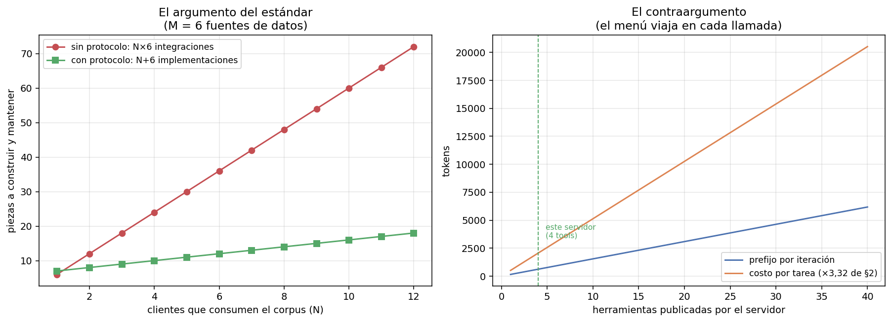

# 04 — MCP como estándar

## El problema es de integración, no de capacidad

Hasta §3 las herramientas del agente vivían dentro del proceso: se registraban en
un `ToolRegistry` de Python y se llamaban en memoria. Eso funciona mientras haya un
solo agente. En cuanto el corpus lo consume algo más —un cliente de escritorio, un
IDE, otro equipo, un script de auditoría— la pregunta deja de ser cómo llamar a la
herramienta y pasa a ser **quién reimplementa la búsqueda**.

Es el problema clásico de interoperabilidad, con la aritmética de siempre:

```
  N clientes   M fuentes   sin protocolo   con protocolo     razón
------------------------------------------------------------------
           2           2               4               4       1.0×
           3           4              12               7       1.7×
           5           6              30              11       2.7×
          10          20             200              30       6.7×
```

Sin protocolo, cada par cliente-fuente es una integración con su autenticación, su
formato y su mantenimiento: **N×M**. Con protocolo, cada cliente lo implementa una
vez y cada fuente lo expone una vez: **N+M**. Y como muestra la primera fila, con
N=M=2 el estándar **no gana nada**: el argumento es de escala, y adoptarlo antes de
tenerla es la sobreingeniería que la doctrina del repo trata de evitar.

Lo que MCP estandariza no es la inteligencia sino la interfaz, con exactamente el
mismo rol que USB, ODBC o POSIX en su momento: mueve la competencia de "quién tiene
la integración" a "quién tiene los datos" — que para un producto sobre corpus
regulatorio chileno es exactamente donde conviene que esté (`05 §9`).



## El servidor: entregable, no ejercicio

[`mcp_corpus_server.py`](../code/mcp_corpus_server.py) publica el corpus chileno
por el protocolo. Se levanta con:

```bash
uv run python 06-harness/code/mcp_corpus_server.py
```

y se configura en cualquier cliente MCP con:

```json
{
  "mcpServers": {
    "corpus-chileno": {
      "command": "uv",
      "args": ["run", "python", "06-harness/code/mcp_corpus_server.py"],
      "cwd": "/ruta/a/estudio-personal"
    }
  }
}
```

Lo que expone son las capacidades que el repo ya había construido, ahora
direccionables desde afuera:

```
servidor            : corpus-normativo-chileno v1.0.0
versión de protocolo: 2026-07-28

publica: 4 tools, 1 resources, 1 plantillas de resource, 1 prompts

  buscar_corpus        (consulta, k)                          ← BM25 de 02
  leer_norma           (doc_id, pagina)                       ← corpus real, paginado
  vecinos_grafo        (doc_id, tipo_relacion, direccion)     ← grafo auditado de 05
  alcance_normativo    (doc_id, max_saltos, direccion)        ← dependencia transitiva, §3
```

Contra el corpus real, por el protocolo:

```
--- alcance_normativo({"doc_id": "decreto-03-reglamento-compras-publicas.txt",
                       "max_saltos": 2, "direccion": "in"})
    4 documentos dependen de decreto-03-reglamento-compras-publicas.txt en hasta 2 saltos:
    - do-02-extracto-licitacion-publica.txt
    - glosa-05-presupuesto-interior.txt
    - oficio-02-contraloria-trato-directo.txt
    - resolucion-01-chilecompra-compra-agil.txt

--- vecinos_grafo({"doc_id": "ley-01-dl-825-iva-base.txt",
                   "tipo_relacion": "modifica", "direccion": "in"})
    ley-02-ley-21210-modernizacion.txt --modifica--> ley-01-dl-825-iva-base.txt
        fundamento: «Artículo primero.- Introdúcense las siguientes modificaciones
                     al Decreto Ley Nº 825, de 1974:»
```

Esa última respuesta es la que justifica todo el trabajo de `05`: la relación no
llega sola, llega **con la cita literal que la sustenta**. Un cliente que consuma
este servidor puede citar la fuente y no el grafo.

## La decisión de diseño que más se equivoca: qué NO exponer

El servidor **no publica `responder`**, aunque `harness_lib` la tenga.

`responder` existe porque el bucle necesita una señal de terminación: es una
preocupación del **harness**, no del corpus. Un servidor MCP publica capacidades
sobre un dominio; el control de flujo del agente se queda del lado del cliente.
Mezclarlos es lo que convierte un servidor reutilizable en el backend privado de un
solo agente — y es un test explícito, no una intención.

La misma frontera explica el reparto entre las tres primitivas del protocolo:

| Primitiva | Qué es | Quién la controla | En este corpus |
|---|---|---|---|
| **Tool** | Una acción que el modelo decide invocar | El modelo | Buscar, leer, recorrer el grafo |
| **Resource** | Datos que el cliente puede leer y cachear por su cuenta | La aplicación cliente | `corpus://indice`, `corpus://{doc_id}` |
| **Prompt** | Una plantilla que el servidor versiona | El usuario | `auditar_dependencias` |

**Resources y prompts son las dos primitivas que casi nadie usa**, y las dos mueven
trabajo de lugar:

- `corpus://indice` publica los 40 identificadores canónicos como *resource*. Si
  fuera una tool, descubrir el catálogo gastaría un turno del modelo. Como
  resource, el cliente lo lee y lo cachea sin consumir contexto — que es
  exactamente el recurso escaso de §2.
- `auditar_dependencias` versiona **del lado del servidor** la consulta más
  frecuente del dominio: *"si cambiara esta norma, ¿qué queda desactualizado?"*.
  Renderizado, sale con la estrategia de uso incluida:

```
Si cambiara ley-03-ley-19886-compras-publicas.txt, ¿qué documentos del corpus
quedarían potencialmente desactualizados?

Usá 'alcance_normativo' con direccion='in' y max_saltos=2 para obtener el conjunto,
y después 'vecinos_grafo' sobre los casos dudosos para ver la cita literal que
sustenta cada dependencia. Respondé con la lista de documentos y el fundamento de
cada uno.
```

Es el patrón de `03 §3` —gestión de prompts versionados— movido al servidor: quien
conoce el dominio escribe cómo se consulta, y los N clientes lo heredan. Un detalle
del contrato: **los argumentos de un prompt son strings, sin JSON Schema**. Es
deliberadamente más débil que una tool, porque un prompt es una plantilla de texto
y no una llamada tipada; la validación queda a cargo del servidor.

## El contraargumento: el menú se paga en cada iteración

Acá es donde §3 le pone un límite al entusiasmo por el estándar. Los esquemas
declarados por este servidor, medidos como llegan al cliente:

```
herramienta              tokens de esquema
------------------------------------------
vecinos_grafo                          203
alcance_normativo                      186
buscar_corpus                          116
leer_norma                             113
TOTAL                                  618
```

Cuatro herramientas por 618 tokens. Con el multiplicador de reenvío de §2 —3,32
iteraciones por tarea— son **~2.052 tokens por tarea sólo en tener el menú a la
vista**, se use o no.

> Un servidor de 40 herramientas del mismo tamaño promedio costaría **~6.180 tokens
> de prefijo**: más que todo el contexto de una tarea típica de este módulo, antes
> de que el agente haga nada.

Y ese es el costo de **un** servidor. Un cliente con cinco servidores conectados
arranca cada iteración con un menú que no cabe en el presupuesto. La objeción
habitual a los servidores grandes es que "confunden al modelo"; la objeción
medible es que **cobran un impuesto fijo sobre todo lo que el agente haga**.

De ahí tres reglas de diseño para publicar un servidor:

1. **Pocas herramientas, de la granularidad correcta.** `alcance_normativo` en vez
   de encadenar `vecinos_grafo` (§3) es exactamente esto: menos llamadas y menos
   menú.
2. **Lo que es dato, va como resource.** El catálogo no necesita un turno del
   modelo.
3. **Descripciones cortas y con ruteo.** La descripción viaja en cada iteración y
   es parte del prompt aunque no se escriba en el prompt.

## Los errores también viajan por el protocolo

El contrato de error de §3 no se pierde al cruzar la frontera del proceso:

```
--- leer_norma({"doc_id": "ds-250"})
    ERROR: 'ds-250' no es un documento del corpus. Usá 'buscar_corpus' o el
    recurso corpus://indice para ubicarlo.

--- leer_norma({"doc_id": "ley-01-dl-825-iva-base.txt", "pagina": 99})
    ERROR: página 99 fuera de rango para 'ley-01-dl-825-iva-base.txt'.
    Este documento tiene 2 página(s). Volvé a llamar con pagina entre 1 y 2.

--- vecinos_grafo({"doc_id": "...", "tipo_relacion": "invalida"})
    ERROR: tipo_relacion 'invalida' inválido. Valores admitidos: aplica, cita,
    deroga, interpreta, modifica, reglamenta.
```

Con una diferencia importante respecto de `harness_lib`: acá el error se devuelve
**como resultado**, no como excepción. Un servidor que lanza una excepción de
protocolo le dice al cliente "la llamada falló"; uno que devuelve texto de error le
dice al modelo qué hacer. La primera es una condición de transporte, la segunda es
el canal de enseñanza de §3 — y sólo la segunda llega al modelo.

## Seguridad: el identificador canónico como frontera

Un servidor MCP es una superficie de ataque: acepta parámetros generados por un
modelo, que a su vez pudo haber leído texto de un tercero. La versión ingenua de
`leer_norma` haría `open(CORPUS_DIR / doc_id)` y sería vulnerable a *path
traversal*.

La defensa acá no es sanitizar la ruta, es **no tener rutas**: `doc_id` se valida
contra el catálogo de 40 identificadores canónicos, y lo que no está en el catálogo
no existe.

```
--- leer_norma({"doc_id": "../../../etc/passwd"})
    ERROR: '../../../etc/passwd' no es un documento del corpus.
```

Es la doctrina #6 del portfolio —llaves canónicas, nunca nombres libres— dando un
beneficio de seguridad que no era su motivación original. Está cubierto por tests
parametrizados con cuatro variantes de escape. §6 trata el resto del problema:
permisos, herramientas con efectos y sandbox.

## Gobernanza: qué cambia cuando el protocolo deja de ser de un proveedor

El dato relevante para quien decide construir sobre esto:

- **9 de diciembre de 2025**: Anthropic dona MCP a la **Agentic AI Foundation
  (AAIF)**, un fondo dirigido bajo la Linux Foundation, co-fundado con Block y
  OpenAI y con apoyo de Google, Microsoft, AWS, Cloudflare y Bloomberg. MCP entra
  como proyecto fundador junto a `goose` (Block) y **`AGENTS.md`** (OpenAI)
  ([Anthropic](https://www.anthropic.com/news/donating-the-model-context-protocol-and-establishing-of-the-agentic-ai-foundation),
  [Linux Foundation](https://www.linuxfoundation.org/press/linux-foundation-announces-the-formation-of-the-agentic-ai-foundation),
  [blog MCP](https://blog.modelcontextprotocol.io/posts/2025-12-09-mcp-joins-agentic-ai-foundation/)).
- **28 de julio de 2026**: se publica la revisión `2026-07-28`, la mayor desde el
  lanzamiento. El protocolo pasa a ser **stateless** (se eliminan el handshake de
  `initialize` y el `Mcp-Session-Id` del transporte HTTP; la versión, la
  identificación y las capacidades del cliente viajan en `_meta` de cada request),
  se agrega un marco de **extensiones** (MCP Apps para UI servida por el servidor,
  Tasks para trabajo de larga duración), se endurece la autorización y se adopta
  una **política formal de deprecación** con tres estados y una ventana mínima de
  doce meses ([changelog oficial](https://modelcontextprotocol.io/specification/2026-07-28/changelog),
  [blog MCP](https://blog.modelcontextprotocol.io/posts/2026-07-28/)).

Es la versión que negocia este servidor: el SDK instalado (`mcp` 2.0) implementa
`2026-07-28` y la sesión del demo lo confirma en vivo.

Dos lecturas para quien construye:

- **La política de deprecación de doce meses es el dato que más importa**, más que
  cualquier feature. Un protocolo con ventana de deprecación explícita es un
  protocolo sobre el que se puede planificar. Que el paso a *stateless* haya sido
  un cambio grande y aun así ordenado es la evidencia de que la gobernanza
  funciona.
- **`AGENTS.md` como proyecto fundador de la misma fundación** cierra un círculo
  con §9: el archivo de instrucciones que este repo ya usa —y que `AGENTS.md` en la
  raíz implementa— dejó de ser una convención de un vendor para volverse un
  artefacto gobernado. El harness personal y el estándar de la industria son el
  mismo objeto a dos escalas.

## Estado del arte (2026)

| Aspecto | Estado | Detalle |
|---|---|---|
| MCP como estándar de facto | ✅ Consenso | Soporte de primera clase en los clientes grandes; ~97M descargas mensuales de SDK al donarse |
| Gobernanza neutral | ✅ Resuelto | AAIF bajo Linux Foundation desde dic-2025; MCP conserva autonomía técnica |
| Revisión `2026-07-28` stateless | 🟢 Publicada | Elimina el handshake y las sesiones de protocolo; simplifica el escalado horizontal |
| Extensiones (MCP Apps, Tasks) | 🟡 Nuevas | Publicadas en la misma revisión; adopción por verse |
| Autorización | 🟡 En endurecimiento | Seis SEPs alineando con OAuth 2.0 / OIDC; DCR deprecado a favor de CIMD |
| Calidad de los servidores publicados | 🔴 Muy despareja | Salidas sin acotar y menús enormes son el fallo más común (§3) |
| Seguridad de servidores de terceros | 🔴 Problema abierto | Conectar un servidor es conceder ejecución; ver §6 |

## Límites

- **El servidor es de sólo lectura.** Ninguna herramienta escribe nada, así que
  todo el capítulo de permisos, idempotencia y sandbox queda para §6. Un servidor
  con efectos laterales es un problema distinto.
- **Sin autenticación.** Corre como proceso local por stdio, para un solo usuario.
  La revisión `2026-07-28` endurece justamente la parte que este servidor no usa.
- **El corpus es sintético.** Está dicho en las instrucciones que el servidor le
  entrega a cualquier cliente: es material de estudio, no fuente jurídica.
- **Los números de N×M son aritmética, no medición.** Ilustran el argumento del
  estándar; el número medido de esta sección es el costo de esquemas (618 tokens),
  y ese sí sale del servidor real.

## Lo que viene en la próxima sección

Con el corpus detrás de un protocolo, aparece la pregunta de organización: si un
agente puede conectarse a varios servidores y una tarea toca varios dominios,
¿conviene un agente con todo el menú a la vista, o un orquestador que reparte
trabajo entre subagentes con menús chicos? El costo de esquemas de esta sección ya
insinúa la respuesta y §5 la mide.

## Conexiones

- **`02` completo**: `buscar_corpus` publica el BM25 de esa masterclass; el
  protocolo no cambió el retrieval, cambió quién puede llamarlo.
- **`05 §2`**: el `fundamento` literal viaja en cada arista, que es lo que permite
  citar la fuente y no el grafo.
- **`03 §3` (gestión de prompts)**: la primitiva `prompt` de MCP es ese registro
  versionado, movido al servidor y compartido entre clientes.
- **`03 §11` (seguridad)**: la validación contra catálogo cierra el path traversal;
  el resto de la superficie es §6.
- **§2**: el multiplicador de reenvío 3,32 convierte el costo de esquemas en el
  número por tarea.
- **§3**: las tres reglas de diseño del servidor son las de esa sección aplicadas a
  un artefacto que consumen terceros.
- **§9**: `AGENTS.md`, proyecto hermano de MCP en la misma fundación, es el harness
  personal de este repo.
