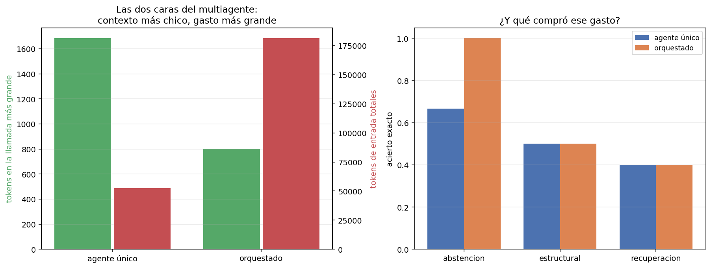

# 05 — Arquitecturas multiagente: cuándo gana un solo agente

## Un subagente no es un modelo más listo: es un contexto separado

La forma en que se vende el multiagente —"un equipo de agentes especializados
colabora"— sugiere que la ganancia es de capacidad. No lo es: el modelo es el
mismo en todos los nodos. Lo único que un subagente aporta y un agente único no
puede tener es **un contexto propio**: sus observaciones, sus errores y sus rodeos
mueren en su bucle, y al orquestador le vuelve un resumen.

Eso lo hace un problema de **estructura organizacional**. Un departamento no piensa
mejor que un individuo; procesa información por separado y le reporta al resto una
versión comprimida. Las ganancias y las patologías de un sistema multiagente son
las de cualquier organización con departamentos: menos sobrecarga arriba, y
fronteras que cortan justo donde el trabajo necesitaba pasar.

## El experimento

Dos arquitecturas, las mismas 12 tareas, el mismo modelo, las mismas capacidades:

```
agente único  : alcance_normativo, buscar_corpus, leer_norma, responder, vecinos_grafo
orquestador   : delegar, responder                    ← no toca el corpus
  trabajador 'documental' : buscar_corpus, leer_norma, responder
  trabajador 'estructural': alcance_normativo, vecinos_grafo, responder
```

El orquestador **no tiene acceso directo al corpus**. Sólo puede delegar y
responder, que es la versión pura del patrón y la que hace visible el efecto. La
división del trabajo tampoco es arbitraria: separa el texto de las normas
(`02-retrieval`) de la estructura de relaciones (`05-ontologias`), que es la
frontera natural del dominio.

Los menús, medidos con el aparato de §3:

```
menú                         tokens de esquema
----------------------------------------------
agente único (5 tools)                     778
orquestador (2 tools)                      325
trabajador documental                      379
trabajador estructural                     533
```

## El resultado

```
métrica                             agente único      orquestado         delta
------------------------------------------------------------------------------
acierto exacto                             0.500           0.583        +0.083
F1 de docs citados                         0.500           0.583        +0.083
tareas sin respuesta                           2               1            -1
pasos del agente principal                    48              40            -8
pasos de trabajadores                          0             152          +152
pasos totales (= llamadas al modelo)          48             192          +144
tokens de entrada TOTALES                 52,416         181,229      +128,813
contexto máximo por llamada                1,684             798          -886
```



Las dos caras, en una frase: **el orquestador procesa contextos de la mitad de
tamaño y gasta 3,5 veces más tokens en total, para acertar una tarea más de doce.**

El aislamiento es real y se ve en el reparto por partida:

```
partida             agente único     orquestador
------------------------------------------------
herramientas              37,392          13,040
observaciones             15,912           3,429
```

Las observaciones del orquestador son **sólo los resúmenes** que le devuelven los
trabajadores: 3.429 tokens contra 15.912. Todo lo que los trabajadores leyeron
—cada fragmento, cada página, cada error— murió en sus bucles. Y la partida de
herramientas cae a un tercio porque el orquestador sólo ve dos esquemas.

## De dónde salió la única tarea ganada

El delta de acierto no está repartido: viene entero de la familia de abstención.

```
familia             agente único    orquestado     delta
--------------------------------------------------------
abstencion                 0.667         1.000     +0.333
estructural                0.500         0.500      0.000
recuperacion               0.400         0.400      0.000
```

La tarea es `t-10`, *"¿Cuál es la multa por infracción a la Ley de Transparencia de
2022?"*, cuya respuesta correcta es que no consta en el corpus. El agente único
quema los ocho pasos alternando búsquedas y lecturas, y nunca responde. El
orquestador:

```
0 delegar(documental,  "¿Cuál es la multa por infracción a la Ley de Transparencia de 2022?")
      → [trabajador 'documental' — 6 pasos, sin conclusión: max_pasos]
1 delegar(documental,  "¿Qué establece la Ley de Transparencia de 2022 sobre las multas...?")
      → [trabajador 'documental' — 6 pasos, sin conclusión: max_pasos]
2 delegar(estructural, "¿Qué norma regula las multas por infracción a la Ley de Transparencia...?")
      → [trabajador 'estructural' — 6 pasos, sin conclusión: max_pasos]
3 responder("No consta en el corpus.")
```

El mecanismo es interesante y no es el que la arquitectura publicita: **el fracaso
de la delegación es información**. Tres especialistas reportando "no pude concluir"
es una señal explícita y barata de leer; ocho búsquedas con resultados mediocres es
la misma evidencia en un formato que hay que interpretar. La abstracción no agregó
capacidad, agregó **un resumen negativo legible**.

Es un mecanismo plausible con n=1 tarea. No alcanza para concluir que el
multiagente abstiene mejor; alcanza para saber qué habría que medir con más tareas
de abstención.

## Dónde se rompe: la frontera cortó una dependencia

Lo más útil de esta sección no es la tabla, es la patología. En `t-08` —la tarea
del DS 250 que viene fallando desde §1— el orquestador delegó **ocho veces**:

```
0 delegar(estructural, "¿Qué documentos dependen en hasta dos saltos del DS 250?")  → sin conclusión
1 delegar(estructural, "¿Qué documentos dependen directamente del DS 250?")         → sin conclusión
2 delegar(estructural, "¿Qué documentos modifican o derogan al DS 250?")            → sin conclusión
3 delegar(estructural, "¿Qué documentos dependen en un salto del DS 250?")          → sin conclusión
4 delegar(estructural, "¿Qué documentos dependen del DS 250?")                      → sin conclusión
5 delegar(estructural, "¿Qué documentos dependen en hasta dos saltos del DS 250?")  → sin conclusión
6 delegar(estructural, "¿Qué documentos dependen en un salto del DS 250?")          → sin conclusión
7 delegar(estructural, "¿Qué documentos dependen del DS 250 en un salto?")          → sin conclusión
```

Ocho delegaciones × seis pasos de trabajador = **48 llamadas al modelo en una sola
tarea**, todas inútiles. Y adentro del trabajador:

```
0 alcance_normativo(doc_id="ds-250")              -> ERROR ... Siguiente paso: usá 'buscar_corpus'...
1 vecinos_grafo(doc_id="ds-250")                  -> ERROR ...
2 alcance_normativo(doc_id="ds-250-ds")           -> ERROR ...
3 vecinos_grafo(doc_id="ds-250-ds")               -> ERROR ...
4 alcance_normativo(doc_id="ds-250-ds-250")       -> ERROR ...
5 alcance_normativo(doc_id="ds-250-ds-250-ds")    -> ERROR ...
```

El trabajador estructural degenera concatenando el identificador. Y la causa es
doble, con las dos mitades en el diseño y no en el modelo:

1. **La división del trabajo cortó una dependencia.** Resolver "DS 250" a
   `decreto-03-reglamento-compras-publicas.txt` es *entity resolution* (`05 §4`), y
   es un **prerrequisito** de recorrer el grafo. Está en el departamento
   documental; el grafo, en el estructural. El agente único de §3 lo resolvió en un
   paso: `buscar_corpus("DS 250")`.
2. **El error le pedía algo imposible.** El mensaje de `vecinos_grafo` dice *"usá
   'buscar_corpus' para ubicar el documento primero"* — y `buscar_corpus` **no está
   en el menú del trabajador estructural**. El contrato de error que §3 midió como
   una mejora se volvió, en otro contexto, una instrucción irrealizable.

> El contrato de error no es una propiedad de la herramienta: es una propiedad de
> la herramienta **en su registro**. La misma tool, montada en dos menús distintos,
> da un consejo útil en uno y una orden imposible en el otro.

3. **El orquestador no puede diagnosticar.** Lo único que ve es *"sin conclusión:
   max_pasos"*. No sabe que el problema era un identificador irresoluble, así que
   hace lo único que puede: reformular. Ocho veces. **El aislamiento de contexto
   que ahorra tokens es el mismo que impide diagnosticar el fallo** — no son dos
   propiedades, es una sola vista desde dos lados.

## Los dos arreglos, medidos

Ambos problemas tienen arreglo obvio. Los dos se implementaron y se midieron, y el
resultado es consistente con todo el módulo.

**Arreglo 1 — que el error conozca el menú.** El `ToolRegistry` detecta cuando un
`siguiente_paso` nombra una herramienta que no tiene y lo avisa:

```
métrica                            error ingenuo  error consciente       delta
------------------------------------------------------------------------------
acierto exacto                             0.583             0.583       0.000
tareas sin respuesta                           1                 0          -1
pasos totales                                192               176         -16
tokens de entrada TOTALES                181,229           172,820      -8,409
subtareas que el trabajador no concluyó       21                18          -3
```

**Arreglo 2 — no partir la dependencia.** El trabajador estructural recupera
`buscar_corpus`:

```
métrica                           agente único     partido    sin partir
--------------------------------------------------------------------------
acierto exacto                           0.500       0.583         0.583
tareas sin respuesta                         2           0             0
pasos totales                               48         176           167
tokens de entrada TOTALES               52,416     172,820       168,377
contexto máximo por llamada              1,684         778           768
subtareas sin concluir                       —          18            16
```

**Ninguno de los dos mueve el acierto.** Los dos recortan desperdicio: menos pasos,
menos tokens, menos subtareas abandonadas. Es exactamente el patrón de §1 y §3 —el
harness arregla el mecanismo que ataca y el resultado no se mueve— repetido por
tercera vez en el módulo, ahora en la capa de coordinación.

Y la familia estructural sigue en 0,500 en las tres configuraciones. `t-08` no se
arregla con organización: sigue trabada donde §3 la dejó, en el criterio de parada.

## Cuándo conviene cada arquitectura

Lo que este experimento permite afirmar, con la escala declarada:

| Situación | Arquitectura | Por qué |
|---|---|---|
| Contexto por tarea holgado (~1.700 tokens acá) | **Un agente** | El multiagente cuesta 3,5× para resolver un problema que no existe |
| Contexto cerca del límite del modelo | Orquestador | Es lo único que baja el pico por llamada (−53% acá) |
| Subtareas **independientes** | Orquestador | Sin dependencias cruzadas, el resumen no pierde nada que importe |
| Subtareas con dependencias (resolver un id antes de usarlo) | **Un agente** | Toda frontera que corte una dependencia se paga con reformulaciones |
| El fallo hay que diagnosticarlo | **Un agente** | El resumen esconde la causa; el orquestador sólo puede reformular |
| Costo por tarea acotado | **Un agente** | 3,5× de tokens y 4× de llamadas es el piso del overhead de coordinación |

La regla corta:

> Antes de repartir el trabajo entre agentes, preguntá **qué información se pierde
> en la frontera**. Si la respuesta es "nada que el jefe necesite", el multiagente
> ahorra contexto. Si es "justo lo que hace falta para diagnosticar el fallo", el
> orquestador va a reformular la misma pregunta hasta quedarse sin pasos.

## El patrón Claude Code planificador + Codex implementador

El caso concreto que motiva esta sección en la práctica del autor es una división
de trabajo entre dos agentes de codificación. A la luz de lo anterior, funciona por
razones que el experimento explica:

- **La frontera no corta una dependencia.** El plan es un artefacto completo y
  autocontenido: quien implementa no necesita volver a preguntar por qué se decidió
  algo, porque el plan lo dice. Es lo contrario del identificador irresoluble.
- **El resumen que cruza es rico**, no un "no pude concluir": un plan es larga y
  deliberadamente explícito. La frontera está diseñada para que pase información,
  no para comprimirla.
- **El diagnóstico vuelve al humano**, no al orquestador. Cuando la implementación
  falla, quien lee el fallo tiene acceso a las dos mitades — que es precisamente lo
  que le faltaba al orquestador de `t-08`.

Y la advertencia que sale del mismo análisis: la división se degrada apenas el plan
deja de ser autocontenido. Un plan que dice "hacé lo que corresponda con los
errores" reproduce el `siguiente_paso` irrealizable a escala humana.

## Estado del arte (2026)

| Aspecto | Estado | Detalle |
|---|---|---|
| Subagentes como aislamiento de contexto | ✅ Consenso | Es el mecanismo real; "más inteligencia" es marketing |
| Orquestador/trabajador | 🟢 Patrón dominante | La topología por defecto de los frameworks multiagente |
| Overhead de coordinación | 🟡 Reconocido, poco publicado | Se sabe que es alto; los factores medidos rara vez se reportan |
| Cuándo un agente le gana a varios | 🟡 En discusión | Recomendación frecuente de empezar con uno solo; poca evidencia comparativa publicada |
| Diagnóstico a través de la frontera | 🔴 Problema abierto | El resumen que ahorra contexto es el que impide diagnosticar |
| Contratos de error por registro | 🔴 No tratado | Las tools se escriben sin saber en qué menú las montan |

## Límites

- **12 tareas, un modelo, una réplica.** El +0,083 de acierto es **una tarea**, y
  además de abstención. Lo robusto es el overhead: 3,5× de llamadas y 3,2× de
  tokens no se explica por ruido.
- **Una sola topología.** Orquestador puro con dos trabajadores. No se probaron
  agentes que se pasen trabajo entre pares, ni jerarquías más profundas, ni un
  orquestador con acceso directo al corpus además de delegar — que probablemente
  sea la configuración práctica más razonable.
- **`max_pasos=6` para los trabajadores** es un parámetro elegido, no barrido. Con
  más presupuesto, algunos trabajadores habrían concluido.
- **La división del trabajo es una de muchas.** Se eligió la frontera natural del
  dominio (texto contra estructura) y resultó ser justo la que corta la
  dependencia de entity resolution. Otra división daría otros números.

## Lo que viene en la próxima sección

Todas las herramientas de este módulo son de lectura, y por eso las llamadas
repetidas de `t-08` fueron caras pero inocuas: 48 llamadas inútiles y ningún daño.
En cuanto una herramienta escriba algo, esa misma trayectoria deja de ser un
desperdicio y pasa a ser un incidente. §6 levanta el supuesto: permisos,
idempotencia y sandbox.

## Conexiones

- **§1**: el mismo patrón por tercera vez —el harness mueve el proceso y no el
  resultado—, ahora en la capa de coordinación.
- **§2**: el contexto máximo por llamada es lo que el multiagente mejora; el total
  de tokens es lo que empeora. Las dos métricas salen del mismo reparto por
  partida.
- **§3**: los menús chicos de los trabajadores son la aplicación directa del peaje
  por iteración, y el `siguiente_paso` irrealizable es el límite de aquel contrato
  de error.
- **§4**: un cliente con varios servidores MCP conectados es este mismo problema de
  menú, sin la contrapartida del aislamiento.
- **`05 §4` (entity resolution)**: resolver "DS 250" a su llave canónica es la
  dependencia que la frontera departamental cortó.
- **§7**: `t-08` gastó 48 llamadas al modelo con acierto cero. Ninguna métrica de
  resultado ve eso, y por eso las trayectorias se evalúan aparte.
- **§8**: 192 llamadas contra 48 para la misma tarea es la varianza de costo que
  esa sección trata.
