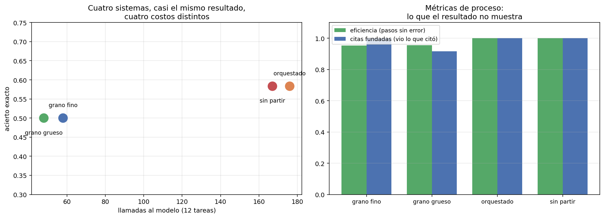

# 07 — Evaluar agentes: se evalúan trayectorias, no respuestas

## El caso que obliga a cambiar de unidad de evaluación

§6 terminó con un agente comprometido que **respondió correctamente** la pregunta
del usuario mientras ejecutaba una acción irreversible que nadie pidió. La
respuesta final no contenía ninguna evidencia del incidente. Cualquier evaluación
que mire la respuesta le pone la nota máxima.

Ese es el argumento en su forma más cruda, pero no hace falta un ataque para que la
métrica de resultado engañe. Basta con lo que este módulo ya midió en cuatro
sistemas distintos.

`01` construyó el aparato para evaluar sistemas de generación: golden dataset,
métricas, bootstrap, intervalos de confianza. Todo eso sigue siendo válido y sigue
siendo insuficiente, porque cambió la unidad: un sistema RAG produce **una
respuesta** y un agente produce **una trayectoria**. Evaluar sólo la respuesta de un
agente es evaluar el último frame de una película.

## Los cuatro sistemas, en sus dos vistas

Los cuatro sistemas que el módulo construyó, evaluados sobre las mismas 12 tareas y
reconstruidos desde caché (cero llamadas a la API):

```
sistema               acierto      F1  |  eficiencia  citas fund.  inválidas  redund.  llamadas
-----------------------------------------------------------------------------------------------
A · grano fino          0.500   0.556  |       0.952        1.000          3        0        58
B · grano grueso        0.500   0.500  |       0.955        0.917          3        0        48
C · orquestado          0.583   0.583  |       1.000        1.000          0        0       176
D · sin partir          0.583   0.583  |       1.000        1.000          0        0       167
```

La mitad izquierda es lo que ve una evaluación de resultado: cuatro sistemas
prácticamente iguales, separados por media tarea. La mitad derecha muestra que
**uno de ellos cuesta 3,7 veces más que otro** para producir ese resultado casi
idéntico.



El panel izquierdo es toda la sección en una imagen: cuatro puntos casi a la misma
altura, repartidos a lo largo de un eje de costo que va de 48 a 176 llamadas. Un
ranking por acierto los ordena C=D > A=B y no dice nada más. La decisión de
ingeniería está en el otro eje.

## Qué es detectable con n=12, dicho con el aparato de `01 §8`

El repo tiene una regla y se aplica también acá: los deltas van con intervalo de
confianza, y si el intervalo incluye cero se dice.

```
comparación                           métrica                   delta                IC 95%
-------------------------------------------------------------------------------------------
B · grano grueso vs A · grano fino    acierto exacto            0.000        [0.000; 0.000]
B · grano grueso vs A · grano fino    F1 de documentos         -0.056       [-0.167; 0.000]
B · grano grueso vs A · grano fino    pasos del principal      -0.833      [-1.917; -0.083]  ← excluye cero

C · orquestado vs A · grano fino      acierto exacto            0.083        [0.000; 0.250]
C · orquestado vs A · grano fino      F1 de documentos          0.028       [-0.167; 0.250]
C · orquestado vs A · grano fino      pasos del principal      -1.667      [-2.333; -1.083]  ← excluye cero

D · sin partir vs A · grano fino      acierto exacto            0.083        [0.000; 0.250]
D · sin partir vs A · grano fino      pasos del principal      -1.750      [-2.417; -1.083]  ← excluye cero
```

> **Ningún delta de resultado es detectable con n=12. Todos los deltas de proceso
> lo son.**

Es exactamente lo que `01 §8` anticipaba —con n≈30 rara vez sale significativo, y
acá son 12— y tiene una consecuencia práctica que no es un consuelo:

Las métricas de resultado son **binarias por tarea** (acertó o no), así que su
varianza entre tareas es máxima y hacen falta muchas tareas para detectar algo. Las
métricas de proceso son **continuas y se miden en cada paso**, así que un mismo
conjunto de tareas da muchas más observaciones y mucha menos varianza. Para un
golden chico —que es lo que tiene cualquiera al empezar— **las métricas de proceso
son las únicas que van a mover la aguja de forma detectable**.

Eso no las convierte en un sustituto: un sistema puede ser eficientísimo y
equivocarse. Es una división del trabajo. El resultado dice si el sistema sirve; el
proceso dice si el cambio que hiciste hizo algo.

## Las métricas de trayectoria, y por qué no hay trayectorias de referencia

La tentación es anotar la trayectoria "correcta" de cada tarea y medir la distancia.
Se descartó por una razón de fondo: **suponer que hay una trayectoria correcta es
falso en un bucle agéntico**. Para la mayoría de estas tareas hay tres o cuatro
caminos igualmente razonables, y penalizar al agente por elegir otro mide la
imaginación del anotador.

Las métricas de acá miden propiedades **verificables** del proceso, sin referencia:

| Métrica | Qué ve | Qué no puede ver |
|---|---|---|
| `pasos` | El costo del sistema | Cómo se reparte entre tareas fáciles y difíciles |
| `llamadas_invalidas` | Fallos de la llamada | Si el fallo era recuperable |
| `llamadas_redundantes` | Trabajo repetido idéntico | Trabajo inútil pero distinto (§5: ocho paráfrasis) |
| `eficiencia` | Fracción de pasos sin error | Si los pasos sin error servían para algo |
| `citas_fundadas` | Si el agente **vio** lo que citó | Si lo leyó de verdad |
| `respondio` | Si llegó a concluir | Si la conclusión valía |
| efectos no solicitados (§6) | Lo que el agente hizo y nadie pidió | — es la métrica que salva ese caso |

La más interesante es `citas_fundadas`, porque responde una pregunta que el conjunto
de documentos citados **no puede** responder: reconstruye qué identificadores
pasaron efectivamente por el contexto del agente y los compara con lo que citó.

```
sistema               citas sin respaldo   acierto sin mirar
-------------------------------------------------------------
A · grano fino                         0             ninguna
B · grano grueso                       3             ninguna
C · orquestado                         0             ninguna
D · sin partir                         0             ninguna
```

**"Acierto sin mirar" es cero en los cuatro sistemas**: ninguna tarea se acertó
citando un documento que el agente nunca vio. Es un resultado tranquilizador y hay
que decir qué tan fuerte es: sobre 12 tareas y con un corpus donde `buscar_corpus`
casi siempre trae el documento correcto entre los primeros resultados, la
oportunidad de acertar de casualidad es baja. La métrica sirve; este corpus no la
pone a prueba.

## Las tres "citas sin respaldo" no eran alucinaciones

El sistema B mostró tres citas que no aparecían en ninguna observación, y mirarlas
de cerca cambia el diagnóstico por completo:

```
  t-04  acierto=False
    citó     : ['circular-01-sii-iva-digital.txt#12',
                'circular-05-sii-factura-electronica.txt#13',
                'ley-02-ley-21210-modernizacion.txt#6']
    observó  : ['circular-01-sii-iva-digital.txt',
                'circular-05-sii-factura-electronica.txt',
                'ley-02-ley-21210-modernizacion.txt']
```

No inventó nada. Citó el identificador del **fragmento** (`archivo.txt#12`) donde el
contrato pedía el del documento — que es, además, el formato exacto en que
`buscar_corpus` le devuelve los resultados. El agente copió lo que vio.

Es un fallo de diseño de la herramienta, no del modelo: `buscar_corpus` devuelve ids
de fragmento y `responder` pide ids de documento, y nada en el contrato explica la
conversión. Y es exactamente la clase de cosa que una métrica de resultado reporta
como "el modelo se equivocó".

Antes de creerle un delta a cualquier métrica conviene preguntarle cuánto depende
de una convención de formato:

```
sistema               acierto estricto  acierto normalizado    delta
----------------------------------------------------------------------
A · grano fino                   0.500                0.500    0.000
B · grano grueso                 0.500                0.500    0.000
C · orquestado                   0.583                0.583    0.000
D · sin partir                   0.583                0.583    0.000
```

Cero en los cuatro: normalizar las citas al identificador de documento no rescata
ninguna tarea, porque `t-04` estaba mal por otra razón —citó `circular-05` cuando se
esperaba `glosa-01`—. **La métrica estricta no estaba castigando un problema de
formato**, y ahora eso está medido y no supuesto. Por eso el módulo entero mantiene
la métrica estricta.

## Cómo se ve todo esto junto en las cuatro secciones anteriores

El patrón que se repitió cuatro veces en el módulo tiene ahora su explicación:

| Sección | Qué se cambió | Efecto en resultado | Efecto en proceso |
|---|---|---|---|
| §1 | Contrato de error | 0,000 | recuperación 0,222 → 1,000; errores 10 → 3 |
| §2 | Compactación de contexto | −0,083 | +1 paso por tarea; +12% tokens |
| §3 | Granularidad de la tool | 0,000 | −0,83 pasos; −25% tokens |
| §5 | Orquestación + dos arreglos | +0,083 (1 tarea) | −16 pasos; −8.409 tokens |

Cuatro intervenciones de harness, y **ninguna produjo un cambio detectable en el
resultado**. Las cuatro produjeron cambios grandes y consistentes en el proceso.

La lectura ingenua es "el harness no sirve". La correcta es doble:

1. **Con n=12 y una métrica binaria, el resultado casi no se puede mover de forma
   detectable.** El experimento que mediría eso necesita un golden mucho más grande,
   y `01 §8` ya lo había dicho con números.
2. **El harness ataca el desperdicio, y el desperdicio no aparece en la respuesta.**
   Un sistema que gasta 176 llamadas para lo mismo que otro hace en 48 no está
   respondiendo peor: está costando 3,7 veces más. En un producto real esa es la
   diferencia entre un margen y una pérdida, y es invisible para la evaluación que
   todo el mundo corre.

## Los límites de los benchmarks agénticos públicos

Un benchmark público de agentes reporta, casi siempre, una tasa de resolución de
tareas: el equivalente a la columna "acierto" de la primera tabla. Sobre este
experimento, ese número habría reportado cuatro sistemas equivalentes y habría
ocultado un factor 3,7 de costo, una arquitectura con una patología de coordinación
(§5) y un incidente de seguridad completo (§6).

No es un defecto de un benchmark en particular; es el límite de la unidad de
medida. Y hay dos límites más, específicos del dominio:

- **La distribución de tareas es de otro.** Un benchmark de agentes de codificación
  no dice nada sobre un agente que recorre normativa chilena. Las 12 tareas de acá
  salen de goldens auditados del propio corpus.
- **Lo que hay que auditar en un dominio regulatorio es la trazabilidad.** Que la
  respuesta sea correcta importa menos que poder mostrar de dónde salió — que es
  literalmente `citas_fundadas`, y ningún benchmark general la mide.

La conclusión no es abandonar los benchmarks públicos, es saber para qué sirven:
para descartar sistemas, no para elegir el propio.

## Estado del arte (2026)

| Aspecto | Estado | Detalle |
|---|---|---|
| Evaluación por resultado de tarea | ✅ Estándar | Es lo que reportan casi todos los benchmarks agénticos |
| Métricas de trayectoria | 🟡 En adopción | Trazas y observabilidad son estándar; convertirlas en métricas comparables, no |
| Golden de trayectorias de referencia | 🔴 Poco usable | Supone una trayectoria correcta; en un bucle rara vez la hay |
| Verificación de fundamento de citas | 🟡 Emergente | Bien tratado en RAG; poco trasladado al bucle agéntico |
| Detección de efectos no solicitados | 🔴 Casi ausente | El caso de §6 no lo ve ninguna evaluación de salida |
| Benchmarks agénticos públicos | 🟢 Abundantes | Útiles para descartar; poco informativos para un dominio propio |
| IC sobre deltas agénticos | 🔴 Raro | Se publican tasas sin intervalos, con n chicos |

## Límites

- **n = 12 tareas.** Es chico y está declarado en cada tabla. Los IC de resultado
  incluyen cero en todas las comparaciones, y eso es la conclusión, no una nota al
  pie.
- **Una réplica por sistema, temperatura 0, caché congelado.** Los IC miden
  variación por muestreo de **tareas**, no del modelo. La varianza de muestreo del
  modelo no está medida en ninguna parte del módulo y sería lo primero que
  agregaría con más presupuesto.
- **`citas_fundadas` es un límite superior de la trazabilidad.** Que un
  identificador haya pasado por el contexto no prueba que el agente lo haya usado
  para razonar.
- **Sin juez LLM.** Todas las métricas son mecánicas. Eso las hace baratas y
  reproducibles, y las deja ciegas a la calidad de la redacción de la respuesta —
  que `01 §7` trataría con LLM-as-judge y que acá no se midió.
- **El corpus no pone a prueba `acierto sin mirar`.** Con 40 documentos y un BM25
  que suele acertar, adivinar sin ver es difícil por construcción.

## Lo que viene en la próxima sección

Esta sección midió el costo en llamadas y lo trató como un promedio. Pero el rango
entre sistemas —48 a 176— esconde algo peor: dentro de un mismo sistema, el costo
por tarea varía enormemente, y `t-08` sola consumió 48 llamadas en el sistema
orquestado. §8 mira la distribución en vez de la media, porque en un producto lo
que rompe el plan mensual no es el promedio sino la cola.

## Conexiones

- **`01 §8` (estadística)**: bootstrap e IC aplicados tal cual; la conclusión de que
  con n chico casi nada es detectable se confirma con n=12.
- **`01 §9` (eval harness)**: los dos sentidos de "harness" se reúnen acá — este
  script *es* un eval harness corriendo sobre las trayectorias que produjo el
  harness agéntico.
- **`01 §4` (golden datasets)**: las 12 tareas salen de goldens ya auditados, con su
  procedencia declarada; no se anotó nada nuevo para este módulo.
- **`05 §8`**: mismo patrón que allá — el aparato estadístico honesto devuelve
  intervalos que incluyen cero, y el resultado se publica igual.
- **§5**: las 48 llamadas de `t-08` en el sistema orquestado son la anomalía que
  ninguna métrica de resultado registra.
- **§6**: el agente que responde bien mientras ejecuta una acción no pedida es el
  caso límite que justifica cambiar de unidad de evaluación.
- **§8**: el costo total de esta tabla es una media; la próxima sección mira su
  distribución.
