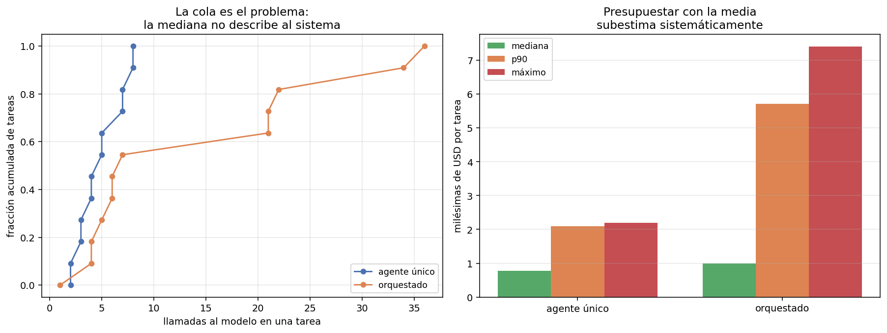

# 08 — Costo y latencia del bucle

## El costo por tarea no es un número, es una distribución

`04` construyó la economía de la inferencia sobre una unidad: el costo de **una
llamada**. Un agente rompe esa unidad, porque no hace una llamada sino N — y N
depende de la tarea, de lo que devuelvan las herramientas y de cuándo el modelo
decida que terminó. **N es una variable aleatoria**, y todo lo que sigue de eso es
el objeto de esta sección.

```
sistema              media   mediana       p90       p95       máx  máx/mediana
-------------------------------------------------------------------------------
agente único         0.997     0.770     2.100     2.164     2.195          2.8×
orquestado           2.422     1.000     5.713     6.581     7.405          7.4×

(costos en milésimas de USD por tarea, gpt-4o-mini)
```

En llamadas al modelo, que es lo que gobierna todo:

```
sistema              media   mediana       p90       máx  máx/mediana
---------------------------------------------------------------------
agente único          4.83       4.5       7.9         8          1.8×
orquestado           13.92       6.5      32.8        36          5.5×
```



Dos cosas que la media esconde:

**La mediana no describe al sistema.** En el sistema orquestado, la tarea mediana
cuesta 6,5 llamadas y la peor cuesta 36: un factor **5,5×** dentro del mismo
sistema, con el mismo modelo y el mismo tipo de tarea. La curva acumulada del panel
izquierdo lo muestra mejor que cualquier tabla: la mitad de las tareas se resuelven
en menos de 7 llamadas y una cola larga se va a 36.

**La media miente hacia abajo.** En el orquestado la media (13,92) está por encima
del p60 de la distribución: la arrastran unas pocas tareas caras. Un presupuesto
construido con la media va a estar mal casi siempre, y el error crece con la cola.

## Qué le hace la cola al plan mensual de `04 §6`

`04 §6` cerró con márgenes brutos sobre 99% y una advertencia: con quince pasos por
consulta, la holgura del plan caía de 7.975× a 12×. Ese cálculo usaba un supuesto
sobre el número de pasos. Ahora hay una distribución medida:

```
sistema             si toda consulta    si toda consulta    razón
                   cuesta la mediana       cuesta el p95         
-----------------------------------------------------------------
agente único                USD 0.77            USD 2.16     2.8×
orquestado                  USD 1.00            USD 6.58     6.6×

(1.000 consultas/mes)
```

**El costo absoluto sigue siendo ruido**: un dólar contra siete dólares al mes no
cambia ninguna decisión de negocio, y la conclusión de `04 §6` se sostiene entera a
esta escala. Lo que cambia es la **predictibilidad**:

> A escala chica, la cola del costo agéntico es un problema de planificación, no de
> plata. A escala grande es un problema de plata — y el factor que la gobierna no es
> el precio del token sino cuántas tareas caen en la cola.

Y hay un corolario que el número absoluto esconde: si el plan se vende por consulta
y el 5% de las consultas cuesta 6,6 veces la mediana, la rentabilidad **por cliente**
depende de la mezcla de consultas de ese cliente. Un cliente que sólo hace preguntas
estructurales de dos saltos no es el cliente promedio: es la cola entera.

## Caching de prefijo: la optimización que el bucle regala

§2 midió que el 51,2% del gasto de entrada del módulo es **prefijo idéntico
reenviado**. El caching de prefijo del proveedor ataca exactamente eso, y es por
lejos la optimización de costo más rentable de un bucle agéntico. Con los números
de este módulo y las reglas reales del proveedor:

```
iteraciones medidas                                   58
tokens de entrada totales                         85,654
prefijo reenviado (iteraciones 2..N)              34,824
de ese prefijo, elegible para caché               25,000
iteraciones por debajo del umbral de 1.024            13
ahorro con 50% de descuento                       12,500

ahorro sobre el gasto de entrada total: 14,6%
```

El descuento de entrada cacheada de `gpt-4o-mini` es del **50%**, se aplica
automáticamente y sólo a partir de **1.024 tokens** de contexto
([OpenAI](https://openai.com/index/api-prompt-caching/),
[docs](https://developers.openai.com/api/docs/guides/prompt-caching)).

De 51,2% de prefijo reenviado a 14,6% de ahorro efectivo hay tres descuentos, y
conviene ver los tres:

1. **La primera iteración escribe el caché, no lo lee.** En trayectorias de 4,8
   pasos promedio, una de cada cinco iteraciones no ahorra nada.
2. **El descuento es del 50%, no del 100%.** El prefijo se sigue pagando, a mitad
   de precio.
3. **13 de 58 iteraciones no llegan al umbral de 1.024 tokens.** Las trayectorias
   cortas —las baratas— son justamente las que no califican. El descuento llega
   donde más se gasta, que es donde tiene que llegar, pero conviene no
   presupuestarlo para el caso barato.

### Tres formas de tirar el descuento a la basura

El caché exige que el prefijo sea **idéntico byte a byte**. Tres cosas lo rompen sin
producir ningún síntoma visible:

- **Una marca de tiempo o un id de sesión en el prompt de sistema.** Parece
  inofensivo y anula el caché de todas las iteraciones.
- **Reordenar las herramientas entre llamadas.** El orden del menú es parte del
  prefijo. `ToolRegistry.specs_openai` ordena por nombre a propósito, y esa línea
  vale un 14,6%.
- **Poner el contexto recuperado antes de las instrucciones.** El prefijo cacheable
  es el que no cambia; lo variable va al final, siempre.

Las tres tienen la misma propiedad incómoda: **el sistema sigue funcionando
perfectamente, sólo cuesta el doble**. No hay test que falle. Es el tipo de
regresión que sólo se detecta mirando la factura, y por eso conviene tener el
porcentaje de prefijo cacheable como métrica observada y no como esperanza.

## Cuándo cortar un bucle que no converge

El módulo acumuló tres casos de bucles que no convergían y ninguno era detectable
desde afuera en el momento:

- `t-08` en §1: ocho pasos enumerando tipos de relación sobre un `doc_id` inválido.
- `t-08` en §3: la respuesta completa en el paso 2, y cinco pasos más expandiéndola.
- `t-08` en §5: el orquestador delegando ocho paráfrasis de la misma pregunta, 48
  llamadas.

La pregunta de diseño es qué regla habría cortado eso. Y tiene una restricción dura:
**la regla tiene que ser observable desde adentro del bucle**, con lo que el harness
ya tiene, sin conocer la respuesta correcta. Una regla que necesite el golden sirve
para el análisis y no para producción.

Tres candidatas, evaluadas sobre las trayectorias reales:

```
--- agente único
regla                     disparó en   pasos ahorrados  respuestas correctas
                             (de 12)                      que habría cortado
------------------------------------------------------------------------------
repetición exacta                  0                 0                     0
sin evidencia nueva                4                 4                     0
racha de errores                   0                 0                     0

--- orquestado
repetición exacta                  0                 0                     0
sin evidencia nueva                4                 8                     1
racha de errores                   0                 0                     0
```

**La regla que el `AgentLoop` traía —repetición exacta de la llamada— no dispara
nunca.** Es la que §1 implementó y §5 ya había mostrado su límite: el agente varía
algún argumento y la regla no lo ve. En `t-08` de §1 recorrió los seis tipos de
relación, todas llamadas distintas y todas inútiles.

**"Sin evidencia nueva" es la regla correcta para el agente único**: tres pasos
seguidos sin que aparezca un identificador de documento nuevo. Dispara en 4 de 12
tareas, ahorra 4 pasos y **no corta ninguna respuesta correcta**. No le importa si
la llamada cambió; le importa si trajo algo.

**Y en el sistema orquestado esa misma regla rompe una respuesta buena.** No es un
detalle de calibración: es la misma ceguera de §5 vista desde otro ángulo. Lo que el
orquestador recibe son resúmenes, y un resumen puede no traer identificadores nuevos
mientras los trabajadores avanzan perfectamente. **La observabilidad del progreso
depende de la arquitectura**, y una regla de corte calibrada en un agente único no
se traslada a uno orquestado.

> Regla de diseño: el criterio de corte se calibra **por arquitectura**, sobre
> trayectorias reales, y se evalúa con dos números — cuánto ahorra y cuántas
> respuestas buenas rompe. Publicar sólo el primero es cómo se justifican los
> cortes agresivos que degradan la calidad sin que nadie lo note.

## Latencia: lo que este módulo no midió

La latencia de un bucle es, en primera aproximación, N veces la latencia de una
llamada, y `04 §1` ya explicó de qué depende cada llamada: el decode domina y el
contexto largo cuesta concurrencia. Sobre eso, el bucle agrega dos cosas:

- **Es secuencial por construcción.** Cada iteración necesita la observación de la
  anterior. Un agente de 8 pasos no puede ser más rápido que 8 llamadas en serie,
  por más capacidad que haya. Es la misma asimetría prefill/decode de `04 §1`, una
  capa más arriba.
- **La cola de la latencia es la cola de N.** Con máx/mediana de 5,5× en llamadas,
  el p95 de latencia es varias veces la mediana. Para una interfaz interactiva eso
  importa más que el costo.

No se midieron tiempos en este módulo, y decirlo es parte del trabajo: todas las
corridas salen de caché, así que cualquier número de latencia que reportara sería
del disco, no del proveedor. La aritmética de `04 §1` y la distribución de N de acá
son suficientes para el orden de magnitud; una medición real de latencia sería el
siguiente paso honesto.

## Estado del arte (2026)

| Aspecto | Estado | Detalle |
|---|---|---|
| Caching de prefijo | 🟢 Maduro | Automático en los proveedores grandes; descuentos del 50% al 90% según modelo |
| Umbral mínimo de caché | 🟡 Poco conocido | 1.024 tokens en gpt-4o-mini; deja fuera las trayectorias cortas |
| Reportar costo agéntico como distribución | 🔴 Raro | Se publica el costo medio por tarea; el p95 casi nunca |
| Reglas de corte | 🟡 Artesanales | Tope de pasos y de gasto son estándar; los criterios de progreso, ad hoc |
| Evaluación de reglas de corte | 🔴 Casi ausente | Se publica el ahorro y no el daño |
| Costo del bucle en unit economics | 🟡 Emergente | `04 §6` lo anticipó; la varianza sigue tratándose como detalle |

## Límites

- **12 tareas.** Un p95 sobre 12 observaciones es, literalmente, la segunda peor.
  Los percentiles altos de acá indican forma, no valor. Es la limitación más seria
  de esta sección y no tiene arreglo sin más tareas.
- **Un modelo, temperatura 0, caché congelado.** La varianza que se mide es entre
  **tareas**, no entre corridas de la misma tarea. La segunda es probablemente
  importante y no está medida en ninguna parte del módulo.
- **El ahorro de caché es un cálculo, no una medición.** Se aplica el descuento
  publicado a los tokens de prefijo medidos. No se corrió el mismo experimento con y
  sin caché contra la API para comparar facturas.
- **Sin medición de latencia.** Ver arriba.
- **Las reglas de corte se evalúan post hoc.** Se calcula dónde habrían disparado
  sobre trayectorias ya producidas. Un bucle que corta de verdad cambia el
  comportamiento posterior del agente, y eso no está medido.

## Lo que viene en la próxima sección

Ocho secciones de harness sobre un agente de corpus regulatorio. La última cambia de
objeto: el harness mejor calibrado que el autor usa todos los días no es el de este
módulo, es el de este **repositorio** — `AGENTS.md`, `BACKLOG.md`, los hooks, las
skills, los subagentes. §9 aplica el mismo marco a esa práctica: qué de eso es
harness y qué es decoración, y qué delegar y qué no.

## Conexiones

- **`04 §1` (prefill/decode)**: el prefijo reenviado es prefill puro, que es
  justamente lo que se puede cachear. La aritmética de latencia por llamada sale de
  ahí.
- **`04 §6` (unit economics)**: la advertencia sobre el factor de pasos por consulta
  se contrasta acá con una distribución medida en vez de un supuesto.
- **`03 §4` (caching multinivel)**: el caching de prefijo es una capa que aquel
  capítulo no tenía, porque en request/response no hay prefijo repetido N veces.
- **`03 §10` (`CostMeter`, `BudgetGuard`)**: el presupuesto por tarea, no por
  llamada, es la unidad correcta para un agente.
- **§1**: la regla de corte por repetición exacta se implementó ahí y acá se muestra
  que no dispara nunca en las trayectorias reales.
- **§2**: el 51,2% de prefijo reenviado es el insumo del cálculo de caché.
- **§5**: la ceguera del orquestador reaparece como un falso positivo de la regla de
  corte. Es el mismo problema de información, no dos.
- **§7**: aquella sección reportó el costo como total; acá se mira su distribución.
