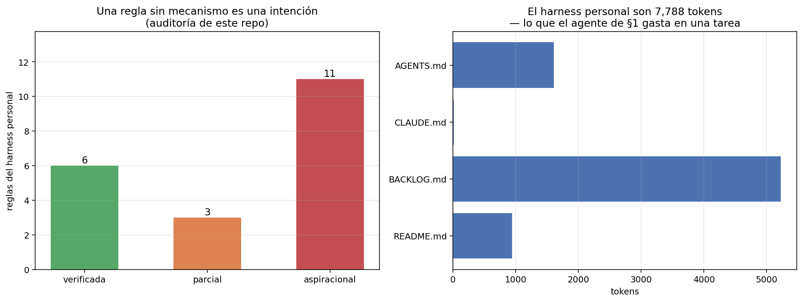

# 09 — El harness como práctica personal

## El harness mejor calibrado de este repo no es el del módulo

Ocho secciones midiendo el entorno de un agente sobre corpus regulatorio chileno. La
última cambia de objeto, porque hay un harness más importante y con mucho más uso:
**este repositorio como entorno de trabajo de un humano que delega en agentes**.
`AGENTS.md`, `BACKLOG.md`, los hooks de sesión, las skills, los permisos. Todo eso
es exactamente lo mismo que el módulo estuvo estudiando —reglas del entorno que
determinan qué percibe el agente, qué puede hacer y qué observa después— sólo que
aplicado a un decisor cuyo bucle dura semanas.

Y como es un harness, se le puede aplicar el mismo marco. Incluida la parte
incómoda.

## El presupuesto: el harness personal es barato

Con el mismo tokenizador de §2:

```
archivo            líneas   tokens   qué es
--------------------------------------------------------------------------
AGENTS.md             153     1607   convenciones del repo
CLAUDE.md               1       13   puntero a AGENTS.md
BACKLOG.md            345     5222   cola de trabajo con IDs estables
README.md              80      946   portada y marco de capas
--------------------------------------------------------------------------
TOTAL                         7788
```

7.788 tokens: aproximadamente lo que el agente de §1 gasta en **una sola tarea**
(7.138 tokens de entrada por tarea). Leer el harness personal entero al empezar una
sesión cuesta lo mismo que hacerle una consulta al agente.

Es un número que vale la pena tener a mano cuando aparece la tentación de recortar
las instrucciones "porque ocupan contexto". El harness personal es barato; lo caro
es no tenerlo. `CLAUDE.md` con 13 tokens —una línea que apunta a `AGENTS.md`— es la
pieza mejor diseñada del conjunto: un puntero en vez de una copia.



### `BACKLOG.md` no es contexto, es memoria externa

5.222 tokens y creciendo con cada tarea cerrada. Si fuera contexto, sería
insostenible. No lo es: es **memoria externa direccionable**, exactamente el patrón
que §2 midió.

Los IDs estables —`B1`, `B7`, `B13`— son las claves. El agente recupera la tarea que
necesita en vez de arrastrar el historial completo, y los commits los referencian
para que la trazabilidad vaya en las dos direcciones. Un backlog sin IDs sería un
historial sin índice: la `VentanaDeslizante` pelada que §2 midió perdiendo el 20% de
la evidencia.

La regla de §2 se traslada literalmente: **lo que se compacta tiene que dejar una
dirección**. Una tarea cerrada no se borra del backlog, se marca cerrada y conserva
su ID.

## La auditoría incómoda: 6 reglas de 20 tienen mecanismo

Acá es donde aplicar el marco al propio proceso deja de ser cómodo. Cada regla
declarada en `AGENTS.md`, en el `CLAUDE.md` global o en la configuración del
cliente, clasificada por si **existe un mecanismo que la haga cumplir sin que nadie
se acuerde**. La clasificación está congelada y anotada a mano en
[`examples/reglas-harness.json`](../examples/reglas-harness.json), con el mecanismo
de cada una.

```
verificada     6 de 20
parcial        3 de 20
aspiracional  11 de 20
```

**Verificadas** — una máquina falla si no se cumplen:

| Regla | Mecanismo |
|---|---|
| `uv run pytest` en verde | CI en cada push y PR |
| Los tests corren sin API keys ni red | El job de CI no define secretos: un test que llame a un proveedor falla ahí |
| No leer ni editar `.env` ni secretos | `permissions.deny` del cliente |
| No `git push --force` ni `git reset --hard` | `permissions.deny` |
| Toda sesión arranca viendo el estado del sistema meta | Hook `SessionStart` |
| Dejar constancia en `meta/DIARIO.md` | Hook `SessionEnd` |

**Aspiracionales** — están escritas y sólo se cumplen si el agente las lee y las
respeta. Entre ellas:

- `uv run ruff check .` en verde — **no está en CI**, y `B12` registra 45 errores
  preexistentes. La regla existe hace meses y la deuda también.
- Sin `print()` en producción — la regla `T201` de ruff no está habilitada.
- PEP 8 a 100 columnas — no hay `[tool.ruff]` en `pyproject.toml`, así que no hay
  largo de línea configurado.
- Commits que referencian el ID del backlog, y conventional commits — sin hook de
  `commit-msg`.
- **Docs actualizadas en el mismo cambio** — la doctrina #4, la regla más citada del
  portfolio y la que menos mecanismo tiene.
- **`data/raw/` es inmutable** — la doctrina #3, sin denegación de escritura ni test
  de hashes que la respalde.

La conclusión no es que las reglas aspiracionales estén mal escritas. Es que:

> Una regla sin mecanismo es una intención, y su tasa de cumplimiento es una
> propiedad del agente que la lee, no del harness. Las que sobreviven a un agente
> distraído, a un modelo nuevo o a una sesión larga son las que tienen alguien —una
> máquina— que las chequea.

Es el hallazgo de §1 a escala de proceso de trabajo, y el de §5 también: un
`siguiente paso` que el destinatario no puede o no va a ejecutar es un consejo
irrealizable, se lo des a un subagente o a vos mismo dentro de tres semanas.

### La excepción que importa

Hay una regla aspiracional que **no se puede automatizar** y es la más importante
del repo: *"no fabricar números; marcar lo no verificable"*. No hay CI que la
verifique. Sólo la sostiene la revisión humana — y la auditoría de `B13` sobre `05`,
que encontró veinte errores después de dar el módulo por cerrado, existe justamente
porque esa regla no tenía mecanismo.

Eso sugiere la división correcta del trabajo:

- **Lo mecanizable, mecanizalo.** Cada regla que se puede convertir en un test o en
  una denegación deja de consumir atención para siempre.
- **La atención humana se reserva para lo que ninguna máquina puede chequear**: si
  el número es real, si el argumento se sostiene, si el experimento mide lo que dice
  medir.

Poner atención humana en verificar el formato de un commit es gastarla donde una
máquina alcanza, y no tenerla disponible donde no.

## El mapa completo

Cada pieza de la práctica personal es una categoría que el módulo ya construyó:

| Pieza de la práctica | Qué es en el módulo | Dónde |
|---|---|---|
| `CLAUDE.md` global + `AGENTS.md` | Prompt de sistema | §2: partida fija, se paga en cada sesión |
| `BACKLOG.md` con IDs estables | Memoria externa direccionable | §2: recuperar por clave |
| Hook `SessionStart` | El paso "percibir", automatizado | §1: el agente no elige si mirar, recibe |
| Hook `SessionEnd` (`DIARIO.md`) | Registro de trayectoria | §7: se evalúa el proceso |
| Skills (`/cierre`, `/nuevo-repo`) | Herramientas de grano grueso | §3: una llamada por intención |
| `permissions` allow/deny | Política de permisos por riesgo | §6: default seguro |
| Subagentes | Aislamiento de contexto | §5: contexto propio, resumen al volver |
| Claude Code + Codex | Orquestador / trabajador | §5: la frontera no corta una dependencia |

Dos observaciones que salen de leer la tabla completa:

**El hook `SessionStart` es la pieza más subestimada.** Convierte el paso "percibir"
de una decisión del agente en una propiedad del entorno. Un agente que *puede*
consultar el estado del proyecto a veces no lo hace; uno que lo *recibe* siempre
opera con él. Es la diferencia entre una herramienta disponible y una observación
garantizada, y §2 mostró el costo de confiar en la primera: el agente usó la memoria
externa **una sola vez en doce tareas** aunque el puntero estuviera en contexto.

**Las skills son herramientas de grano grueso, y §3 explica por qué funcionan.**
`/cierre` no es un atajo de escritura: es la unidad de delegación correcta para la
intención "terminar bien una sesión de trabajo". Sin ella, esa intención son ocho o
diez pasos que hay que acordarse de pedir en orden — el mismo problema de
granularidad que hacía irresoluble a `t-08`.

## `AGENTS.md` dejó de ser una convención

Un cierre que conecta con §4: `AGENTS.md` —el archivo que este repo usa desde el
principio— entró en diciembre de 2025 a la **Agentic AI Foundation** como proyecto
fundador, junto a MCP y a `goose`
([Linux Foundation](https://www.linuxfoundation.org/press/linux-foundation-announces-the-formation-of-the-agentic-ai-foundation)).

Dejó de ser una costumbre de un vendor para volverse un artefacto gobernado, con la
misma política de deprecación de doce meses que el protocolo. El harness personal y
el estándar de la industria resultaron ser el mismo objeto a dos escalas — y la
apuesta de escribir las convenciones en un archivo plano, versionado junto al
código, envejeció bien.

## Qué delegar y qué no

El criterio que sale de las nueve secciones, en tres preguntas y en este orden:

**1. ¿Es reversible?** (§6) Si deshacerlo es barato, delegalo y revisá después. Si
no —un push forzado, un borrado, una migración—, el agente propone y un humano
aplica. La denegación explícita de `git push --force` y `git reset --hard` en la
configuración es esta regla ya implementada.

**2. ¿Cuánto cuesta verificarlo?** Si verificar el trabajo cuesta más que hacerlo,
delegar no ahorró nada: movió el trabajo de producir a revisar. Es el costo de
monitoreo de §6, y es la razón por la que conviene delegar tareas cuyo resultado
tenga un chequeo barato — un test que pasa, un número que se reproduce, un script
que corre.

**3. ¿El error se detecta o se acumula en silencio?** La más importante y la menos
obvia. Un agente que rompe un test avisa solo. Un agente que introduce un número mal
derivado en un documento de teoría **no avisa**, y el error se cita en la sección
siguiente, y en la otra. `B13` es esa acumulación medida: veinte errores encontrados
después del cierre de `05`.

De las tres, la tercera es la que decide. **Lo que no conviene delegar sin
supervisión no es lo difícil: es lo que falla en silencio.** Escribir un experimento
completo es delegable porque el experimento corre o no corre. Escribir la conclusión
del experimento no lo es, porque una conclusión mal sacada se lee igual de bien que
una buena.

## Lo que queda en pie de las seis masterclasses

Este es el último documento del repo, así que corresponde el balance.

Lo que **se construyó y funciona**: un corpus de 40 documentos con cadenas de citas
verificadas, un pipeline de retrieval evaluado con IC, una librería de patrones de
producción, un modelo de costos de inferencia, un grafo normativo auditado con cita
literal por arista, y un servidor MCP que expone todo eso por un protocolo estándar.
Seis librerías reutilizables y 197 tests que corren sin red.

Lo que **salió negativo y se publicó igual**: self-hosting pierde contra la API
(`04 §4`); expandir el grafo *a priori* no mejora retrieval (`05 §8`); compactar el
contexto por debajo del punto de equilibrio cuesta plata (§2); ninguna intervención
de harness movió el resultado de forma detectable con n=12 (§7). Cuatro resultados
que un portfolio optimizado para impresionar no incluiría, y que son la parte del
repo en la que más confío.

Lo que **queda abierto**, sin maquillarlo:

- El `n` es chico en todos lados. 12 tareas acá, 30 queries en `02`, 18 competency
  questions en `05`. Es la limitación estructural del repo y no se arregla
  escribiendo otro módulo: se arregla anotando más datos.
- El corpus es sintético. Todo lo construido es transferible; ninguno de los números
  lo es.
- `B12` sigue abierta: la regla de lint que este mismo documento acaba de clasificar
  como aspiracional.

La próxima frontera honesta no es un módulo 07. Es cualquiera de estas tres, en este
orden: poner el servidor MCP de §4 a trabajar contra un corpus real y no sintético;
agrandar los goldens hasta que los intervalos de confianza digan algo; y cerrar el
único mecanismo que falta para que la regla más importante del repo —no fabricar
números— tenga alguien que la chequee.

## Estado del arte (2026)

| Aspecto | Estado | Detalle |
|---|---|---|
| Archivos de instrucciones para agentes | ✅ Estándar gobernado | `AGENTS.md` es proyecto fundador de la AAIF desde dic-2025 |
| Hooks de ciclo de vida | 🟢 Disponibles | Presentes en los clientes de codificación; poco usados para cerrar el bucle de aprendizaje |
| Skills / comandos reutilizables | 🟢 En adopción | La unidad de delegación correcta para intenciones repetidas |
| Reglas verificables vs. aspiracionales | 🔴 No tratado | Casi nadie audita cuántas de sus reglas tienen mecanismo |
| Orquestación entre clientes distintos | 🟡 Artesanal | El patrón planificador/implementador funciona y no está estandarizado |
| Memoria de proyecto entre sesiones | 🟡 En disputa | Convive el archivo plano versionado con la memoria propietaria del cliente |

## Límites de esta sección

- **La clasificación de las 20 reglas es mía y es discutible.** Está anotada una por
  una con su mecanismo justamente para que se pueda discutir: el archivo dice por
  qué cada regla quedó donde quedó.
- **"Verificada" significa que existe un mecanismo, no que sea infalible.** El CI
  corre los tests que hay; una regla puede estar verificada por un test que no cubre
  el caso que importa.
- **No se midió el cumplimiento efectivo.** Lo honesto sería revisar N commits y
  contar cuántos respetan cada regla. Eso mediría el cumplimiento; esto mide el
  mecanismo, que es la variable de diseño.
- **Un solo repo y un solo autor.** Nada de esto dice cómo escala a un equipo, donde
  el problema del harness es de coordinación y no sólo de memoria.

## Conexiones

- **§1**: el hook `SessionStart` es el paso "percibir" convertido en propiedad del
  entorno en vez de decisión del agente.
- **§2**: `BACKLOG.md` es memoria externa con índice; los archivos de instrucciones
  son la partida fija del presupuesto.
- **§3**: las skills son herramientas de grano grueso, y las reglas verificables son
  contratos que una máquina puede chequear.
- **§4**: `AGENTS.md` y MCP son proyectos hermanos de la misma fundación — el harness
  personal y el estándar de la industria, a dos escalas.
- **§5**: Claude Code planificador + Codex implementador funciona porque el plan es
  autocontenido y la frontera no corta una dependencia.
- **§6**: las denegaciones de `git push --force` y `.env` son la política de permisos
  por irreversibilidad, ya implementada.
- **§7**: el `DIARIO.md` que escribe el hook de cierre es un registro de trayectoria;
  evaluar el proceso y no sólo el resultado.
- **`05 §9` / `B13`**: la auditoría posterior al cierre es lo que pasa cuando la
  regla más importante no tiene mecanismo.
