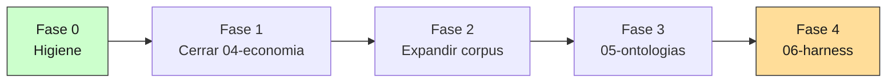

# BACKLOG — Estudio Personal

Cola de trabajo del repo. IDs estables (`B1`, `B2`…), prioridad `P0`–`P2`, criterios
de aceptación verificables. Los commits referencian el ID (`feat(ontologias): B7 —
sección 3`). Si una tarea cambia de alcance o estado, se actualiza aquí en el mismo
cambio.

Última revisión: **2026-08-04**.

---

## Estado de las masterclasses

| #  | Módulo                    | Secciones | Estado      |
|----|---------------------------|-----------|-------------|
| 01 | Evaluación de sistemas IA | 12/12     | Terminado   |
| 02 | Information Retrieval     | 9/9       | Terminado   |
| 03 | Patrones de producción    | 12/12     | Terminado   |
| 04 | Economía de inferencia    | 6/6       | Terminado   |
| 05 | Ontologías y representación del conocimiento | 9/9 | **En revisión** |
| 06 | Harness agéntico          | 0/9       | Planificado |

---

## Hoja de ruta

El orden es **secuencial**, no paralelo (doctrina: completar un módulo antes de
abrir el siguiente).

| Fase | Contenido | Tareas | Estado |
|---|---|---|---|
| 0 | Higiene del repo | B1–B4 | ✅ Hecha (`ec94dea`) |
| 1 | Cerrar 04-economia (re-especificado a 6 secciones) | B5 | ✅ Hecha |
| 2 | Expandir corpus 16 → 40 documentos | B6 | ✅ Hecha |
| 3 | 05-ontologias | B7 + B13 | ✅ Terminada |
| 4 | 06-harness | B8 | Siguiente fase |

---

## Tareas abiertas

### B1 · P0 · Estado real en README y marco de capas invariantes
El `README.md` es la portada del sitio público (`docs/index.md` es symlink) y
declaraba 02 y 03 como "Pendiente" cuando están terminadas.

- [x] Tabla de estado refleja el estado real de los seis módulos.
- [x] El README presenta el repo como las **cuatro capas invariantes** de un
      producto sobre corpus regulatorio, con cada módulo colgando de una capa.
- [x] Enlace a este backlog desde el README.

### B2 · P0 · BACKLOG.md como cola de trabajo
- [x] Este archivo existe con IDs estables, prioridades y criterios verificables.
- [x] Referenciado desde `AGENTS.md` como lectura obligatoria al inicio de sesión.

### B3 · P1 · Higiene de repositorio
- [x] `.vscode/` ignorado (`git status` limpio).
- [x] `AGENTS.md` documenta `tests/`, `BACKLOG.md` y los módulos 05–06.
- [x] `mkdocs.yml` incluye la hoja de ruta en la navegación.

### B4 · P1 · Suite mínima de tests
`pyproject.toml` declara `pytest` y hay dos librerías reutilizables reales
(`retrieval_lib.py`, `prod_lib.py`) sin un solo test.

- [x] `tests/` con smoke tests que corren **sin API keys ni red**.
- [x] `uv run pytest` pasa en verde (55 tests).
- [x] Los tests corren en CI en cada push y PR
      (`.github/workflows/tests.yml`).

### B11 · P2 · Discrepancia en STOPWORDS_ES
Detectada al escribir los tests de B4. El comentario sobre `STOPWORDS_ES` en
`02-retrieval/code/retrieval_lib.py` afirma que en dominio legal palabras como
"no", "sin" o "menor" cambian el sentido y por eso **no** se filtran — pero
`sin` **sí está** en la lista. `no` y `menor` están correctamente fuera.

Impacto acotado: afecta queries donde "sin" es discriminante (p. ej. "operaciones
*sin* derecho a crédito fiscal"). **Arreglarlo mueve las métricas publicadas en
toda la masterclass 02**, así que no se toca de forma aislada.

- [ ] Decidir entre las dos salidas: (a) sacar `sin` de la lista y **re-correr los
      benchmarks de 02**, documentando el delta con IC; o (b) corregir el
      comentario para que describa la lista real y justificar por qué `sin` se
      filtra.
- [ ] Si se elige (a), actualizar los números citados en las secciones afectadas
      de `02-retrieval/theory/`.

### B5 · P0 · Cerrar 04-economia (re-especificado)
**Diagnóstico (2026-08-03):** entre el 60% y el 70% del temario original de 04 ya
está escrito en otros módulos — caching en `03 §4`, selección/versionado de modelos
en `03 §8`, presupuestos y cost-aware routing en `03 §10`, frontera de Pareto en
`01 §10`. Ejecutarlo tal como estaba especificado sería duplicación.

Se re-especifica a **6 secciones**, cubriendo solo lo que ningún módulo toca:

1. Mecánica de la inferencia: prefill vs. decode, KV cache, por qué el primer
   token y el token N-ésimo no cuestan lo mismo.
2. Batching y throughput vs. latencia: continuous batching, la curva de
   utilización, por qué el proveedor te cobra lo que te cobra.
3. Cuantización y destilación: qué se pierde, cómo se mide lo que se pierde
   (con el aparato de `01 §8`).
4. Self-hosting vs. API: punto de equilibrio explícito, costo total incluyendo
   operación, y a qué volumen deja de ser una decisión obvia.
5. Deriva de las curvas de precio: qué supuestos de costo envejecen y en qué
   plazo; cómo escribir un modelo de costos que no caduque en seis meses.
6. Unit economics de un SaaS regulatorio: margen por consulta (no costo por
   token), mezcla de planes, y el costo marginal de un cliente más.

**Criterios de aceptación:**
- [x] `04-economia/theory/00-plan.md` con el temario re-especificado y una nota
      explícita de qué quedó absorbido por 01/03 y dónde.
- [x] Seis secciones con ejemplo numérico sobre el corpus chileno, tabla de estado
      del arte y sección "Conexiones" (mismo template que 01–03).
- [x] Código ejecutable por sección; sin duplicar componentes de `prod_lib.py`
      (las tarifas se importan desde ahí). Núcleo en `econ_lib.py`.
- [x] `README.md` del módulo y `mkdocs.yml` actualizados.

**Resultado principal (negativo, y por eso útil):** a la escala de un producto B2B
chileno, el costo de inferencia es ruido — $10.80/mes (§4), márgenes brutos sobre
99% (§6). El punto de inflexión no es el precio del token sino la **arquitectura
agéntica**: con 15 pasos por query y modelo premium, la holgura del plan cae de
7.975× a 12×. Consecuencia para el orden de trabajo: optimizar inferencia hoy es
procrastinación; el tiempo rinde más en corpus (B6) y ontología (B7).

### B6 · P1 · Expandir corpus de 16 a 40 documentos — ✅ Cerrado (2026-08-03)
Prerrequisito de B7: `02 §8` ya advirtió que 16 documentos no alcanzan para que las
diferencias entre arquitecturas sean estadísticamente detectables, y un grafo sobre
16 nodos no muestra nada interesante.

- [x] 24 documentos nuevos en `shared/corpus_chileno/` (16 → 40), organizados en
      **cuatro clusters temáticos** con densidad de relaciones (modifica / deroga /
      reglamenta / cita / aplica): compras públicas (ley → reforma → reglamento →
      resolución → dictamen → DO), tributario ampliado (Renta + servicios
      digitales), presupuesto y ejecución (ley → glosas → modificación → oficio
      DIPRES), y probidad + educación pública (dos cadenas que convergen en un
      dictamen). Cada cluster tiene una cadena de citas verificada contra
      documentos reales del corpus, pensada como insumo directo para el grafo de
      `05-ontologias`.
- [x] Se respetan las restricciones de abstención: verificado por grep que ningún
      documento nuevo menciona "Ley de Transparencia" (`gd-025`), "DFL Nº 3"
      (`gd-026`) ni presupuesto de años distintos de 2024 (`gd-027`).
- [x] Inventario del README del corpus actualizado con el fenómeno que ejercita
      cada documento nuevo, por cluster.
- [x] `uv run python 02-retrieval/code/08-benchmark-retrievers.py` corre y se
      registró el movimiento: recall@3 baja en todos los sistemas con más
      distractores (−0.037 a −0.093), el denso es el más afectado (−0.093,
      confunde cercanía temática con relevancia), Hybrid-RRF es el único que no se
      mueve (consistente con `02 §3`). Tabla completa en el README del corpus.
- [x] `uv run pytest` sigue en verde (55 tests; no dependen del tamaño del corpus).

### B7 · P0 · Masterclass 05 — Ontologías y representación del conocimiento — ✅ Cerrado (2026-08-04, remediado por B13)

Las 9 secciones están escritas y la evidencia fue reconstruida por B13. Los
resultados históricos del cierre `91eaebf` se conservan en la nota de auditoría;
las cifras siguientes son las vigentes.

**Encuadre:** una ontología es un sistema de clasificación formalizado. El
clasificador presupuestario chileno (partida → capítulo → programa → subtítulo →
ítem → asignación) *es* una ontología; COFOG, CIIU, CIUO y UNSPSC también. El
módulo no enseña una disciplina nueva: le pone nombre y formalismo a una que el
autor ya ejerce, y la conecta con retrieval.

Cubre el material transversal #5 (capas invariantes) y #6 (knowledge graphs,
GraphRAG) del inventario temático.

**Temario:**
1. Qué es una ontología y por qué ya construiste varias. Taxonomía vs. tesauro vs.
   ontología vs. grafo de conocimiento.
2. Modelado del dominio regulatorio chileno: entidades, relaciones, *competency
   questions* como método de diseño.
3. Cuánto formalismo comprar: SKOS < RDF/OWL < property graph pragmático. Regla de
   decisión explícita para no sobre-construir.
4. Identidad y llaves canónicas: entity resolution (DIPRES = Dirección de
   Presupuestos), RUT de organismos, `cut_comunal`. Es *record linkage*.
5. Extraer la ontología del corpus: extracción con LLM + esquema Pydantic, tasa de
   error medida, costo por documento.
6. Vigencia temporal y versionado normativo: bitemporalidad; caso Ley 21.210 ↔
   DL 825, ya sembrado en el corpus y marcado como pendiente en `02 §9`.
7. Del grafo al retrieval: GraphRAG y su economía. Costo de indexación de Microsoft
   GraphRAG; LightRAG, HippoRAG, RAPTOR, agentic graph retrieval. Cuándo el grafo
   paga y cuándo un filtro de metadatos (`02 §7`) hace lo mismo por 1/100.
8. Evaluar un sistema con ontología: el grafo debe ganarse el lugar con deltas e
   intervalos de confianza (aparato de `01 §8`), más métricas de la ontología misma.
9. La ontología como foso competitivo: por qué un modelo mejor no comoditiza esto.

**Criterios de aceptación:**
- [x] `00-plan.md` + 9 secciones con el template de 01–03.
- [x] Grafo real sobre el corpus (networkx + esquema Pydantic) y extractor con LLM.
- [x] Benchmark honesto grafo vs. híbrido reutilizando `golden-retrieval.json`, con
      IC. Si el grafo no gana, **el resultado negativo se publica**.
- [x] Documento sobre EU AI Act / governance dentro del módulo (ver B9).

**Resultado vigente:** el grafo normativo tiene 38 normas y 69 relaciones
literales. En §8, la expansión fuerte empata con BM25; expandir todas las
relaciones reduce recall@3 y recall@5 en 0,033, con IC que incluye cero. El golden
de retrieval no mide multi-hop. §9 usa un golden separado de 18 preguntas y tres
réplicas: el LLM crudo obtiene F1 0,439 [0,289; 0,594] y el delta frente al
conocimiento curado es −0,561 [−0,711; −0,406]. Se concluye una brecha detectable
de recuperación en este benchmark, no un foso comercial demostrado.

**Corrección de rumbo documentada (§4):** el ejemplo "DIPRES = Dirección de
Presupuestos" del temario original no se pudo usar — verificado por grep, "DIPRES"
no aparece ni una vez en el corpus real. El ejemplo grounded que se usó en su lugar
fue la Dirección de Compras y Contratación Pública (tres formas textuales reales:
nombre completo, forma corta, "CHILECOMPRA").

**Fechas de B9 verificadas contra fuente primaria** (no solo DOUE genérico, sino el
texto exacto): Reglamento (UE) 2026/1744, publicado 24-07-2026, en vigor desde
27-07-2026 — confirma los diferimientos a diciembre 2027 (Anexo III) y agosto 2028
(Anexo I) que el inventario había anticipado sin poder verificar.

### B8 · P0 · Masterclass 06 — Harness agéntico
**Encuadre:** el harness es diseño institucional. El mismo modelo rinde
radicalmente distinto según las reglas, la información y los incentivos del entorno
en que opera — por eso rediseñar el bucle rinde más que cambiar de modelo.

"Harness" aquí significa el **harness agéntico** (bucle, contexto, herramientas,
permisos), no el eval harness — ese está en `01 §9` y se trata como su antepasado.
Cubre el tema #7 del inventario (orquestación Claude Code + Codex).

**Temario:**
1. Qué es un harness y por qué decide la calidad más que el modelo. El bucle
   percibir → decidir → actuar → observar.
2. Context engineering: el contexto como recurso escaso con problema de asignación.
   Compaction, memoria externa. Conecta con 02 (retrieval como mecanismo de contexto).
3. Diseño de herramientas: la tool como contrato. Granularidad, esquemas, mensajes
   de error como canal de enseñanza. Por qué una tool que devuelve 40k tokens rompe
   el bucle.
4. MCP como estándar: protocolo y primitivas; consolidación bajo Linux Foundation.
5. Arquitecturas multiagente: cuándo gana un solo agente con buen contexto.
   Orquestador/trabajador; subagentes como aislamiento de contexto, no como "más
   inteligencia". El patrón Claude Code planificador + Codex implementador.
6. Control, permisos y sandboxing: checkpoints humanos, idempotencia de tool-calls
   (sembrado en `03 §6`), sandbox de ejecución. Conecta con `03 §11`.
7. Evaluar agentes: se evalúan trayectorias, no respuestas. Métricas de trayectoria
   vs. de resultado. Límites de los benchmarks agénticos.
8. Costo y latencia del bucle: un agente hace N llamadas, no una; la varianza del
   costo por tarea es el problema real. Caching de prefijo. Cuándo cortar un bucle
   que no converge.
9. El harness como práctica personal: `AGENTS.md`, hooks, skills, subagentes,
   perfiles de Codex. Qué delegar y qué no.

**Criterios de aceptación:**
- [ ] `00-plan.md` + 9 secciones con el template de 01–03.
- [ ] **Servidor MCP funcional sobre el corpus chileno** como entregable de §4
      (artefacto de portfolio, no ejercicio).
- [ ] Un agente evaluado con métricas de trayectoria sobre una tarea del dominio.

### B9 · P2 · Documento de governance / EU AI Act — ✅ Cerrado (2026-08-04, dentro de B7/§9)
Material de alto valor para entrevista y **perecedero**. Vive como documento dentro
de 05-ontologias, no como masterclass propia. El gancho con 05 es real: un
fine-tuning sustancial puede reclasificar a un *deployer* como *provider*.

- [x] Fechas del Omnibus verificadas **contra fuente primaria**: Reglamento (UE)
      2026/1744, DOUE 24-07-2026, en vigor 27-07-2026
      ([EUR-Lex](https://eur-lex.europa.eu/eli/reg/2026/1744/oj/eng)). El Omnibus ya
      no es una propuesta: es un reglamento publicado y vigente. Confirma dic-2027
      (Anexo III) y ago-2028 (Anexo I).
- [x] Cada afirmación normativa con enlace a su fuente — ver
      `05-ontologias/theory/09-la-ontologia-como-foso.md`, sección de governance.

### B10 · P2 · Enlazar artículos publicados desde blog-drafts
`blog-drafts/` está vacío salvo el README. El artículo sobre riesgos fiscales de
desastres naturales (Chile/España) ya está publicado en el blog.

- [ ] `blog-drafts/README.md` enlaza los artículos publicados derivados del estudio.
- [ ] No duplicar el contenido en este repo — solo enlazar.

### B12 · P2 · Deuda de lint en 01-evals y 02-retrieval
`uv run ruff check .` reporta 45 errores, todos preexistentes en `01-evals/code/`
(38), `02-retrieval/code/` (5) y `shared/` (2). `03-produccion`, `04-economia` y
`tests/` están limpios. Detectado al cerrar B5; no se arregló ahí para no mezclar
cambios de módulos terminados en un commit de otro módulo.

- [ ] `uv run ruff check .` en verde (17 son autofixables con `--fix`).
- [ ] Verificar que cada script tocado sigue produciendo los mismos números que
      cita su documento de teoría.
- [ ] Añadir `ruff check` al job de CI para que no vuelva a acumularse.

### B13 · P0 · Remediar auditoría posterior al cierre de 05-ontologias — ✅ Cerrado (2026-08-04)

La auditoría independiente del commit de cierre `91eaebf` confirmó el núcleo de
19 de 20 hallazgos y clasificó uno como mixto. El detalle, evidencia reproducible
y estado de las correcciones locales está en
[`05-ontologias/notes/01-auditoria-post-cierre.md`](05-ontologias/notes/01-auditoria-post-cierre.md).

B7 conserva 9/9 secciones escritas y vuelve a estado terminado. B8 queda como
siguiente fase.

- [x] Aprobar un plan de remediación que ordene dependencias entre corpus,
      ground truth, librería, experimentos y narrativa.
- [x] Integrar o ajustar las correcciones locales existentes sin perder sus
      tests de regresión.
- [x] Recalcular todas las métricas afectadas desde artefactos reproducibles y
      sin llamadas de red en tests.
- [x] Rediseñar §8 para que cada métrica pueda variar por construcción y agregar
      un golden específico multi-hop si se mantiene esa conclusión.
- [x] Reemplazar el experimento `n=1` de §9 o rebajar explícitamente el alcance
      de su conclusión; retirar el titular 100% vs. 50%.
- [x] Sincronizar teoría, scripts, diagramas, README y BACKLOG con los resultados
      finales; `uv run pytest` debe permanecer en verde.

---

## Decisiones tomadas

**2026-08-03 · Revisión del inventario temático y hoja de ruta**

| Decisión | Resolución |
|---|---|
| Significado de "harness" | **Agéntico** (bucle, contexto, herramientas), no eval harness. |
| Qué hacer con 04-economia | **Re-especificar** a 6 secciones sobre lo no cubierto, no cerrarlo por absorción ni ejecutarlo como estaba. |
| Orden de ejecución | **04 → 05 → 06.** No abrir módulos nuevos con uno pendiente visible en el sitio público. |
| Governance / EU AI Act | **Documento dentro de 05**, con verificación contra fuente primaria. |

**Desfase detectado en el inventario temático.** El inventario (fechado al 2 de
agosto) describe un estado de ~junio: daba por pendiente el bloque de evaluación de
IR (hecho en `02 §8`), pedía completar 02–04 (02 y 03 cerrados), y asumía
scaffolding de módulos 05–09 que nunca se creó. La hoja de ruta vigente es **este
archivo**, no el inventario.

---

## Fuera de alcance

Explícito para que ninguna sesión futura los reabra por inercia:

- **Módulos 08 (model adaptation) y 09 (MLOps/cloud)** del inventario. Baja
  prioridad para el perfil; el propio inventario los marcaba como "conceptuales,
  sin pipelines".
- **Bloque D del inventario (robótica, SO-101, electrónica).** Fuera del alcance
  declarado del repo (IA aplicada a corpus regulatorio y fiscal chileno). Si se
  retoma, va en repo propio.
- **Bloque C (Mercado Público, desastres naturales, CV PNUD).** Cada uno tiene su
  hogar: `buscador-oportunidades`, el blog, y material personal respectivamente.
  Aquí solo se enlaza (B10).
