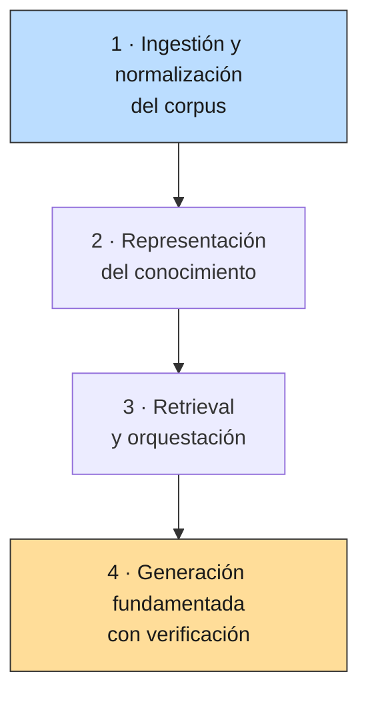

# Estudio Personal — IA aplicada a corpus regulatorio chileno

Sistema de estudio estructurado en masterclasses sobre cómo se construye un producto
de conocimiento sobre corpus regulatorio y fiscal chileno: normativa, presupuesto
público, Diario Oficial. Teoría, código ejecutable y ejemplos numéricos sobre un
corpus real del dominio.

## La tesis

Bajo las diferencias de superficie, todo producto serio sobre un corpus legal tiene
**las mismas cuatro capas**. Los módulos de este repo no son una lista de temas
sueltos: cada uno cubre una capa.



| Capa | Dónde se trabaja |
|---|---|
| 1 · Ingestión y normalización | `shared/corpus_chileno/` · chunking en **02 §4** |
| 2 · Representación del conocimiento | **05-ontologias** |
| 3 · Retrieval y orquestación | **02-retrieval** · **06-harness** |
| 4 · Generación fundamentada y verificación | **01-evals** · **03-produccion** |

Lo que diferencia a un producto en este mercado no es la capacidad bruta del modelo
—que se comoditiza— sino la calidad del corpus curado, la ontología de dominio
embebida en el diseño, la profundidad de integración en el flujo de trabajo real y
las citas verificables. Ese es el hilo que atraviesa los seis módulos.

## Masterclasses

| #  | Tema                        | Carpeta          | Secciones | Estado      |
|----|-----------------------------|------------------|-----------|-------------|
| 01 | Evaluación de sistemas IA   | [01-evals/](01-evals/README.md)         | 12/12 | Terminado |
| 02 | Information Retrieval       | [02-retrieval/](02-retrieval/README.md) | 9/9   | Terminado |
| 03 | Patrones de producción      | [03-produccion/](03-produccion/README.md) | 12/12 | Terminado |
| 04 | Economía de inferencia      | [04-economia/](04-economia/README.md)   | 6/6   | Terminado |
| 05 | Ontologías y representación | [05-ontologias/](05-ontologias/README.md) | 9/9 | En revisión |
| 06 | Harness agéntico            | —                                        | 0/9   | Planificado |

Los módulos se hacen **en orden**, uno cerrado antes de abrir el siguiente. La cola
de trabajo vigente, con temarios y criterios de aceptación, está en
[BACKLOG.md](BACKLOG.md).

## Cómo se lee

Cada sección sigue el mismo template: el concepto explicado desde intuición
económica, un **ejemplo numérico sobre el corpus chileno** (no un ejemplo de
juguete), un script ejecutable que produce los números citados, una tabla honesta de
**estado del arte** (qué está resuelto, qué sigue siendo artesanal) y una sección de
**conexiones** con el resto del repo.

Si una afirmación no está verificada, se marca. Si un experimento sale negativo, se
publica igual.

## Arranque rápido

```bash
git clone <repo-url> && cd estudio-personal
uv sync
cp .env.example .env   # completar con API keys reales

uv run pytest                                        # tests
uv run python 02-retrieval/code/01-ir-clasico.py     # cualquier demo
uv run mkdocs serve                                  # sitio en local
```

Todo el código se ejecuta con `uv run`, nunca con `python` directo.

## Para LLMs trabajando aquí

Lean [AGENTS.md](AGENTS.md) primero (convenciones de naming, estructura, ejecución y
contenido) y [BACKLOG.md](BACKLOG.md) después (qué toca hacer y qué está fuera de
alcance).
